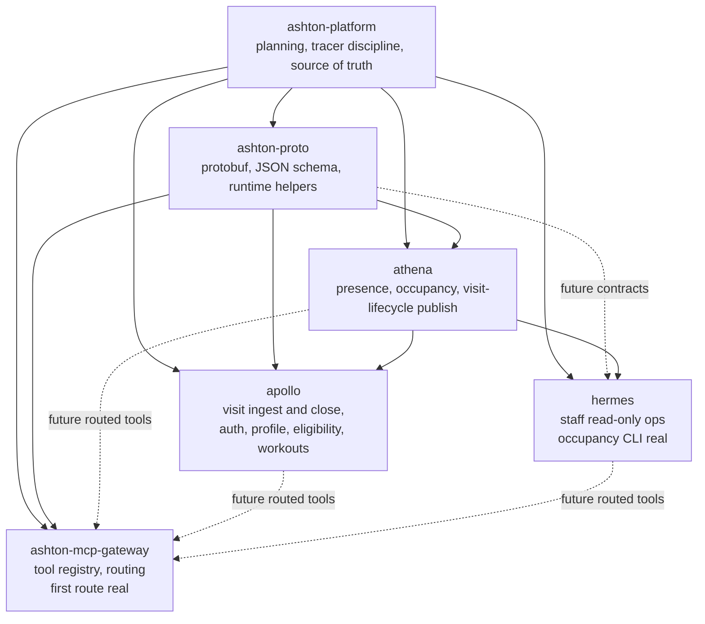
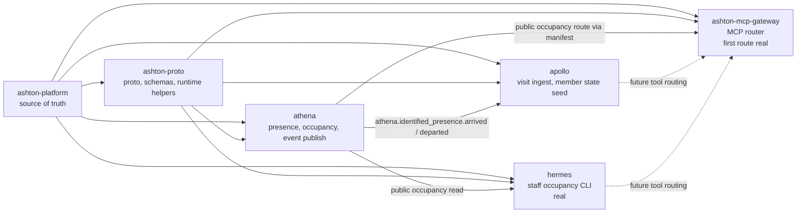

# ashton-platform

Canonical source-of-truth repo for the ASHTON application stack.

> ASHTON is a contract-first, Go-first platform split across five repos with one
> locked ownership model: `ATHENA` owns physical truth, `APOLLO` owns member
> intent, `HERMES` stays staff-only, and `ashton-mcp-gateway` is a narrow
> control layer widened only after the service surfaces prove they are worth
> routing.

This repo is intentionally not a deployable app. Its job is to keep the system
readable as one coherent platform instead of five drifting repos.

## Start Here

| Reader | Start With | Why |
| --- | --- | --- |
| Recruiter or interviewer | [`Current Platform State`](#current-platform-state), [`Audit Snapshot`](#audit-snapshot), [`Current Real Flow`](#current-real-flow) | These sections show what is already real without making you read every repo |
| Engineer joining the stack | [`planning/repo-briefs/`](planning/repo-briefs/), [`Source Of Truth Split`](#source-of-truth-split), [`planning/IMPLEMENTATION-BOARD.md`](planning/IMPLEMENTATION-BOARD.md), [`planning/runbooks/phase-2-launch.md`](planning/runbooks/phase-2-launch.md) | These files define repo ownership, active release lines, Phase 2 operating rules, and where runtime truth actually lives |
| Architect or planner | [`planning/STARSHOT-VISION.md`](planning/STARSHOT-VISION.md), [`planning/envisioning/ui-truth-consolidation.md`](planning/envisioning/ui-truth-consolidation.md), [`planning/audits/2026-04-04-stack-audit.md`](planning/audits/2026-04-04-stack-audit.md), [`planning/sprints/TRACER-MATRIX.md`](planning/sprints/TRACER-MATRIX.md), background essays in `planning/architecture/` | Use the star-shot for ladder and phase context, the UI truth consolidation as the buildability arbiter for product/UI work, the audit for current-state grounding, the tracer matrix for historical closure detail, and the architecture essays only as background reference |

## Current Platform State

| Repo | Role | Current State | Why It Matters |
| --- | --- | --- | --- |
| `ashton-proto` | Shared contracts, schemas, runtime helpers | Real and active | Keeps producers and consumers from hand-rolling wire contracts |
| `athena` | Physical truth for presence and occupancy | Real and executable | First Go service, first operational data surface, active visit-lifecycle publisher, and bounded live edge-driven occupancy deployment now widened to the `v0.7.0` storage/analytics line over the same browser-reachable ingress path |
| `apollo` | Member-facing application, competition runtime, planner substrate, deterministic coaching substrate, bounded nutrition substrate, facility-scoped presence substrate, scheduling substrate, and helper read layer | Real and executable, but intentionally narrow | First member auth, profile-state, visit-history, visit-closing, derived eligibility, explicit lobby membership, explicit workout runtime, deterministic recommendation slice, thin member shell, tagged Tracer 24 planner/coaching truth on `main`, the narrow `v0.15.1` hardening patch line, the current Tracer 28 authz/staff-boundary repo/runtime closeout line, and the later `Phase 3 shared substrate B` scheduling line on `main`; deployed truth unchanged |
| `hermes` | Staff-facing operations assistant | Real and executable, but intentionally narrow | Read-only occupancy plus one richer reconciliation question over ATHENA current + stable-history truth, with deployment proof still bounded to the earlier occupancy runner slice |
| `ashton-mcp-gateway` | Shared tool routing layer, with approvals still deferred | Real and executable, but intentionally narrow | Two caller-aware audited ATHENA reads are real without widening into writes or broad orchestration |
| `Prometheus` | Deployment truth and GitOps control plane | Real and active, but intentionally selective | Carries the bounded live ATHENA `v0.7.0` edge deployment plus the bounded `ATHENA -> NATS -> APOLLO` cluster proof, and now also the bounded HERMES runner slice while gateway deployment slices remain deferred |

## Status Table

| Area | State now | Truth level | Meaning |
| --- | --- | --- | --- |
| ATHENA runtime | `v0.5.1` shipped; the Tracer 18 facility-truth line plus the `v0.6.1` hardening follow-up are on `main`; `v0.7.0` is now shipped and live as the bounded Postgres-backed storage/analytics line | published runtime truth plus current repo truth | durable-history groundwork, facility truth, Postgres-backed append-only observations, derived session facts, and bounded internal analytics are now real without widening into booking, dashboards, or prediction |
| ATHENA deployment | earlier `Prometheus v0.0.3` / `ashton-platform v0.0.19` closeout remains historical; live cluster now runs `athena v0.7.0` | published deployment truth | bounded live edge-ingress deployment truth is real and now includes the storage/analytics repin over the same narrow external surface |
| APOLLO member runtime | `v0.9.0` shipped | published runtime truth | auth, visits, workouts, recommendation, explicit membership, and deterministic preview are real |
| APOLLO member shell | `v0.7.0` shipped | published runtime truth | thin shell is real and still intentionally narrow |
| APOLLO backend/runtime | current Tracer 28 repo/runtime line plus the current `v0.19.1` hardening follow-up and the later `Phase 3 shared substrate B` line are on `main`; deployed truth unchanged | current repo/runtime truth | sport registry, facility-sport capability mapping, authenticated internal HTTP queue/assignment/lifecycle truth, immutable result capture, sport-and-mode-separated ratings, session-scoped standings, self-scoped member stats, planner / exercise-library / template / richer-profile / deterministic-coaching plus bounded nutrition / helper-read / facility-scoped presence substrate, explicit role/authz with trusted-surface-gated staff competition mutations and durable actor attribution, and APOLLO-owned schedule resources/resource-graph/typed-block truth are real without widening into public/social competition reads or public booking |
| HERMES | `v0.2.0` shipped | published local/runtime truth plus bounded deployment truth | one bounded staff read plus one richer reconciliation read are shipped, while the bounded internal runner deployment in `agents` still proves only the occupancy slice |
| Gateway | current Tracer 15 line plus the current `v0.2.1` hardening follow-up are on `main` | narrow repo truth | caller identity, persisted audit, stricter caller/manifest/request boundaries, and a second routed read are real in the current gateway repo line, while write governance and deployment remain deferred |
| Prometheus deployment repo | live for bounded ATHENA, APOLLO, and HERMES deployment truth | published deployment truth | bounded HERMES manifests now exist; gateway deployment slices remain deferred |
| Platform docs | current Milestone 2.0 control-plane closeout line on `main`; current ATHENA deploy truth and later APOLLO shared substrate B truth are both later than that closeout note | current control-plane truth | front-facing ladder, repo/runtime patch hardening lines, and deployed-truth boundaries should now be read with the later bounded `athena v0.7.0` deploy widening and APOLLO scheduling closeout in mind |

## Milestone 2.0 Reconciliation Snapshot

Canonical note:
[`planning/audits/2026-04-10-milestone-2.0-reconciliation.md`](planning/audits/2026-04-10-milestone-2.0-reconciliation.md)

| Repo | Current local/runtime truth | Deployed truth |
| --- | --- | --- |
| `apollo` | `v0.19.1` hardening follow-up: graceful shutdown, HTTP/NATS/request bounds, single shared-parser ingest path, and workout safety hardening | unchanged |
| `athena` | `v0.6.1` hardening follow-up: graceful shutdown, HTTP timeouts, bounded publish retry/backoff, and bounded dedupe memory | historical Milestone 2.0 local/runtime ruling; later deploy truth widened to the bounded live `v0.7.0` storage/analytics line |
| `ashton-mcp-gateway` | `v0.2.1` hardening follow-up: constant-time caller comparison, declared-argument enforcement, manifest path hardening, and bounded tool-call decode | unchanged and still undeployed |
| `Prometheus` | no Milestone 2.0 manifest change | current bounded ATHENA/APOLLO/HERMES deployment truth stands as-is |

## Pillar Map

| Pillar | Real now | Strong after next ladder |
| --- | --- | --- |
| Physical truth service | yes | yes |
| Physical truth live deployment | yes | yes |
| Cross-repo lifecycle event boundary | yes | yes |
| Member truth runtime | yes | yes |
| Member shell | yes | yes |
| Explicit member intent | yes | yes |
| Deterministic coordination preview | yes | yes |
| Staff read surface | yes, thin | yes, stronger |
| Staff observability | yes | yes |
| Staff live deployment truth | yes | yes |
| Control-plane routed read | yes, thin | yes |
| Control-plane identity + audit | yes, narrow | yes |
| Durable edge observation history | yes | yes |
| Operator review / reconciliation read surface | yes, narrow | yes |

| Pillar count | Value |
| --- | --- |
| Meaningful pillars real now | **14** |
| Meaningful pillars after Tracer 16 + Tracer 17 | **14** |

## Phase 2 Posture

| Topic | Rule |
| --- | --- |
| Frontend | keep it thin or absent through all of Phase 2 |
| Demo work | defer to Phase 3 |
| First truthful surface | CLI, internal HTTP, or bounded operator tooling is enough |
| Modularity target | make each tracer a narrow backend pillar that agents can inspect and harden cleanly |
| Ordering bias | structural pillars first, then operational/competition base, then planner/coaching/nutrition/presence/authz backend |

## Post-Milestone 2.0 Next Ladder

`Phase 3 shared substrate A` is already closed in repo/runtime truth on the
later `athena v0.7.x` line: `v0.7.0` established the substrate, `v0.7.1`
closed the bounded projector absent-state retention patch, and the later
`athena main` line added a compact durable projector-miss guardrail without
changing replay authority. Deployed truth remains on immutable `athena v0.7.0`,
and that deploy closeout is separate from the active implementation ladder.

`Phase 3 shared substrate B` is now also closed in APOLLO repo/runtime truth
on `main`: schedule resources, resource-graph truth, typed blocks,
RFC3339-only calendar windows, block-timezone recurrence, explicit exceptions,
and active-plus-bookable inventory-claim semantics are now real. That RFC3339
contract is the anti-ambiguity runtime boundary; later shells may render
friendlier local formats, but they should translate back into explicit
RFC3339 boundaries instead of reintroducing date-only semantics. The planning
phrase `owner/admin CLI first` still maps to owner-only runtime truth today
because APOLLO has no distinct `admin` role yet.

The active next ladder is now:

| Order | Line | Repo focus | Purpose | Hard stop |
| --- | --- | --- | --- | --- |
| 1 | `Phase 3A.3` | `apollo` plus `hestia` only if the audit proves one tiny consumer change is needed | member truth completion over the closed `Hestia` runtime so the member product consumes only real visit, tap, facility, and self-history truth | no fake booking UI, no ops-shell drift, and no reopening `Hestia` or APOLLO wider than the missing member truth requires |
| 2 | later APOLLO authz/admin widening only if earned | `apollo` | add a distinct `admin` role only if real runtime/product needs justify it, then let admin do owner-like graph work intentionally | no accidental role widening hidden inside `Phase 3A.3` |

## Post-ATHENA Ladder

`Cleanup 0` is complete in this docs pass. It is intentionally docs-only and
not a tagged runtime line.

`Tracer 16` is now shipped in `athena`, and `v0.0.23` is the Tracer 16
control-plane closeout line in this repo.

`Tracer 17` is now shipped as `hermes v0.2.0`, bounded `athena v0.5.1`, and
`ashton-platform v0.0.24`, while deployed truth remains unchanged.

| Line | Repo focus | Release line | Purpose | Hard stop |
| --- | --- | --- | --- | --- |
| `Tracer 14` | `hermes` | `v0.1.1` / `v0.0.20` | observability hardening for the existing occupancy slice | no richer question, no writes |
| `Milestone 1.7` | `hermes` plus companion deploy repo | `v0.1.2` only if runtime changes later, otherwise deployment closeout only / `v0.0.21` | prove live HERMES deployment truth over a bounded internal runner slice | no write authority or public ingress |
| `Tracer 15` | `ashton-mcp-gateway` plus optional `ashton-proto` | `v0.2.0` / `v0.0.22` | caller identity, persisted audit, and second routed read | no approvals or writes yet |
| `Tracer 16` | `athena` | `v0.5.0` / `v0.0.23` | durable edge-observation groundwork and ingress hardening | no prediction, no broad rollout claims |
| `Tracer 17` | `hermes` plus bounded `athena` support | `v0.2.0` / `v0.5.1` / `v0.0.24` | operator / reconciliation read surface backed by stable public upstream truth | no overrides or writes |
| `Tracer 18` | `athena` | `v0.6.0` / `v0.0.25` | facility catalog, hours, zones, closure windows, and per-facility metadata read surfaces | no social or product logic |
| `Tracer 19` | `apollo` | `v0.10.0` / `v0.0.26` | sport registry, facility-sport capability mapping, and basic sport rules/config for at least two sports | no full matchmaking yet |
| `Tracer 20` | `apollo` | `v0.11.0` / `v0.0.27` | team, roster, session, and match container primitives | no public standings |
| `Tracer 21` | `apollo` | `v0.12.0` / `v0.0.28` | matchmaking / queue / assignment flow and session lifecycle | no rivalry or badge logic |
| `Tracer 22` | `apollo` | `v0.13.0` / `v0.0.29` | result capture, ratings, rudimentary standings, and member profile stats | no broad public social layer |
| `Tracer 23` | `apollo` | `v0.14.0` / `v0.0.30` | planner, exercise library, templates/loadouts, and richer profile inputs as backend/CLI-first truth | no meaningful frontend widening |
| `Tracer 24` | `apollo` | `v0.15.0` / `v0.0.31` | deterministic coaching substrate: conservative load logic, bounded progression, and explicit feedback capture | no diagnosis, no opaque black box |
| `Tracer 25` | `apollo` | `v0.16.0` / `v0.0.32` | conservative nutrition substrate: nutrition profile, meal logging, meal templates, and calorie/macro ranges | no diagnosis, no obsessive nutrition sprawl |
| `Tracer 26` | `apollo` | `v0.17.0` / `v0.0.33` | explanation, summarization, bounded AI helper flows, and thin agent-facing helper surfaces over stable deterministic cores | no public social feed, no LLM-first decision core, no frontend-first pivot |
| `Tracer 27` | `apollo` | `v0.18.0` / `v0.0.34` | member presence, tap-link, and streak substrate over explicit visit truth | no fake streak counters, no silent visit inference beyond approved link logic |
| `Tracer 28` | `apollo` | `v0.19.0` / `v0.0.35` | role/authz, actor attribution, trusted-surface primitives, and staff runtime boundary substrate | no broad staff product polish, no speculative contract widening |
| `Milestone 2.0` | cross-repo closeout | patch closeout only unless runtime truth changes / `v0.0.36` | Phase 2 backend/base plateau with deploy truth, CLI/internal surfaces, agent-safe proposal/apply rails, and docs aligned | not a broad demo milestone |
| `System-Proof Milestone` | cross-repo | later than `v0.0.36` | verify the tracer ladder and deployment milestones as one modular system | no new feature surface |

## What The Next Lines Must Achieve

| Line | Concrete outcome | Why it matters |
| --- | --- | --- |
| `Tracer 14` | HERMES logs request, result, and outcome clearly with low-noise structured logs | makes the staff slice operationally inspectable |
| `Milestone 1.7` | live HERMES occupancy read was deployed and verified through a bounded internal runner slice | upgrades the staff pillar from local truth to bounded deployment truth |
| `Tracer 15` | gateway gains caller identity, persisted audit, and one second routed read | turns the control plane from a demo route into a trusted narrow layer |
| `Tracer 16` | ATHENA gains durable edge-observation groundwork | removes all-memory dependence and sets up operator history / reconciliation groundwork |
| `Tracer 17` | HERMES answers one richer operator/reconciliation question from stable public upstream truth | creates the first real operator / reconciliation read surface |
| `Tracer 18` | ATHENA gains facility catalog, hours, zones, closure windows, and metadata reads | gives later sports and scheduling logic trustworthy facility truth |
| `Tracer 19` | APOLLO gains sports and facility-sport capability truth for at least two sports | creates the first honest competition substrate |
| `Tracer 20` | APOLLO gains team, roster, session, and match container primitives | gives competition runtime a real container model |
| `Tracer 21` | APOLLO gains matchmaking / queue / assignment flow and session lifecycle | makes execution truth real beyond preview |
| `Tracer 22` | APOLLO gains results, ratings, standings, and member profile stats | turns competition history into usable truth |
| `Tracer 23` | APOLLO gains planner and richer profile inputs as backend-first truth | adds the workout/planning substrate without dragging Phase 2 into frontend work |
| `Tracer 24` | APOLLO gains deterministic coaching substrate over planner, profile, and workout history | makes conservative load/progression guidance real without risky claims |
| `Tracer 25` | APOLLO gains conservative nutrition substrate and meal logging | adds nutrition truth without turning the product into a diet app |
| `Tracer 26` | APOLLO gains explanation, bounded AI helpers, and agent-facing helper reads over stable deterministic cores | improves usability without making the model the core engine |
| `Tracer 27` | APOLLO gains member-facing visit/tap-link/streak truth | makes presence a real member product surface instead of a fake UI badge |
| `Tracer 28` | APOLLO gains explicit role/authz and staff-runtime boundary substrate | makes later ops UI and agent approval workflows honest instead of implied |
| `Milestone 2.0` | the backend/base ladder is closure-clean across repos with agent-safe proposal/apply discipline | turns the platform from a pile of tracers into a modular backend plateau ready for Phase 3 productization |
| `System-Proof Milestone` | system-level proof of runtime truth, deployment truth, modularity, and maintenance model | shifts the platform from a pile of tracers to a coherent system |

## Proof Ladder

| Line | Minimum proof |
| --- | --- |
| `Tracer 14` | repeated HERMES runs, success/failure logs, no runtime widening |
| `Milestone 1.7` | rollout proof, live occupancy read, cluster smoke, safe negative proofs, docs aligned |
| `Tracer 15` | repeated routed reads, caller identity proof, persisted audit proof, second route proof |
| `Tracer 16` | durable-history groundwork behaves deterministically, restart / reload story is explicit, and no raw-ID leakage regresses |
| `Tracer 17` | richer question is source-backed, deterministic, read-only, and operationally useful |
| `Tracer 18` | invalid facility metadata, bad hours windows, missing zones, and closure-window conflicts fail cleanly without corrupting existing occupancy truth |
| `Tracer 19` | bad sport rules, invalid facility-sport mappings, and incompatible sport/facility combinations reject cleanly and repeatably |
| `Tracer 20` | duplicate team/session creation, invalid transitions, roster conflicts, and ownership/auth failures reject cleanly |
| `Tracer 21` | duplicate assignment, stale queue state, invalid lifecycle transitions, and replay attempts fail deterministically |
| `Tracer 22` | tampered results, stale standings recompute, per-sport separation, and anti-garbage-data checks all behave deterministically |
| `Tracer 23` | invalid exercise/machine IDs, impossible planner states, duplicate template names, ownership/auth failures, and no cross-domain mutation |
| `Tracer 24` | extreme stats, missing history, cold starts, and deterministic reruns all behave conservatively without medical overclaiming |
| `Tracer 25` | dietary restrictions, budget/cooking constraints, missing nutrition history, and conservative reruns behave safely without clinical overclaiming |
| `Tracer 26` | explanation/helper output remains traceable to deterministic core logic and never invents unsupported advice |
| `Tracer 27` | spoofed tap links, duplicate streak events, cross-facility confusion, and fake inferred presence all fail cleanly |
| `Tracer 28` | role escalation, trusted-device bypass, actor-attribution gaps, unauthorized staff/member mutation, and approval-path drift all fail cleanly |
| `Milestone 2.0` | repo audit plus deploy audit plus decision-doc alignment plus CLI/internal and proposal/apply coherence checks across the full ladder |
| `System-Proof Milestone` | repo audit plus deployment audit plus boundary audit plus post-tracer roadmap |

## Execution Rules

| Rule | Requirement |
| --- | --- |
| Pre-`1.0.0` semver | new bounded runtime capability = `minor`; hardening, docs sync, deploy closeout, observability, and bounded fixes = `patch` |
| Commits | make granular commits aligned to one slice of truth at a time |
| Push | push clean `main` after closure-clean state; do not leave repo truth local |
| Branching | do not leave closure claims on side branches |
| Hardening | destructive checks are mandatory, not optional |
| Docs | update repo-local docs first, then `ashton-platform` as the control-plane ledger |
| Frontend | keep it thin or absent through Phase 2; CLI/internal/operator surfaces count as real |
| Contracts | widen `ashton-proto` only when a tracer creates a real shared dependency |
| LLM use | use LLMs later for explanation or summarization, not as the first opaque decision engine |

## Current Product Truth

| Area | State |
| --- | --- |
| member shell | real, thin |
| explicit membership | real |
| deterministic preview | real |
| workouts | real, but not planner-grade |
| workout recommendation | real, but deterministic and narrow |
| game sessions | bounded internal execution truth is real locally; results/history/public competition reads are not |
| leaderboards | not real |
| social graph / rivalries | not real |
| operator review tools | real, but bounded to one read-only reconciliation question |
| Phase 2 frontend posture | intentionally thin or absent |

## Feature Bank

| Feature | Bucket | Repo owner | Needs real history first? | Earliest sane point | Why / boundary |
| --- | --- | --- | --- | --- | --- |
| HERMES request / result / outcome logger | Must have | `hermes` | no | `Tracer 14` | makes the current staff slice inspectable |
| Gateway caller identity + persisted audit | Must have | `ashton-mcp-gateway` | no | `Tracer 15` | needed before broader routing or any later write governance |
| Durable ATHENA edge observation history | Must have | `athena` | no | `Tracer 16` | removes all-memory dependence and enables rebuild / review |
| Richer operator review / reconciliation read | Must have | `hermes` | yes | `Tracer 17` | turns HERMES into a real operator surface |
| Facility catalog / hours / zones / closure windows | Must have | `athena` | no | `Tracer 18` | trustworthy facility truth should exist before sport/session logic builds on it |
| Sport registry and facility-sport capability mapping | Must have | `apollo` | no | `Tracer 19` | creates the first honest competition substrate |
| Team / roster / session / match containers | Must have | `apollo` | no | `Tracer 20` | makes execution truth possible beyond preview |
| Matchmaking queues and assignment flow | Must have | `apollo` | yes | `Tracer 21` | wait for real session containers first |
| Result capture, ratings, standings, and member stats | Must have | `apollo` | yes | `Tracer 22` | required before truthful competition reads |
| Workout planner / weekly plan / machine dropdowns | Must have | `apollo` | no | `Tracer 23` | move planner after the competition/operations base is real |
| Exercise library with machine / free-weight / sport tags | Must have | `apollo` | no | `Tracer 23` | planner and recommendation substrate |
| Saved workout templates / loadouts | Must have | `apollo` | no | `Tracer 23` | makes planning and repetition practical |
| Progression history | Must have | `apollo` | yes | `Tracer 23` and later | turns workouts into meaningful trends |
| Deterministic fitness recommendation engine | Must have | `apollo` | partial | `Tracer 24` | planner plus profile plus history, no opaque core |
| Conservative calorie / macro target range | Must have | `apollo` | no | `Tracer 25` | useful only as non-medical guidance |
| Nutrition profile and meal logging | Must have | `apollo` | no | `Tracer 25` | nutrition truth must exist before polished meals UX |
| Coaching explanation and bounded AI helper flows | Must have | `apollo` | no | `Tracer 26` | AI should explain and propose within deterministic rails |
| Member-facing tap-link and streak truth | Must have | `apollo` | yes | `Tracer 27` | turns physical presence into an honest member-facing product surface |
| Explicit role/capability boundary and staff runtime substrate | Must have | `apollo` | no | `Tracer 28` | required before a truthful ops shell or broader agent approvals exist |
| Agent-facing proposal/apply rails | Must have | `apollo` | no | `Tracer 28` and later | agents should propose and preview changes, not bypass domain validation |
| Transparent admin audit | Must have | `ashton-mcp-gateway` and later ops surfaces | yes | `Tracer 15` onward | needed before competition becomes public |
| Streak-friendly meal logging | Good later | `apollo` | no | `Tracer 25` | useful if it stays low-friction and non-obsessive |
| Meal templates | Good later | `apollo` | no | `Tracer 25` and later | lowers friction for simple logging |
| Weekly trend summary | Good later | `apollo` | yes | `Tracer 25` and later | better than noisy daily views |
| Goal presets and training archetypes | Good later | `apollo` | no | `Tracer 23` and later | helps profile and plan selection |
| Progressive overload suggestions | Good later | `apollo` | yes | later than `Tracer 24` | only if conservative and explainable |
| LLM-backed recommendation explainer | Good later | `apollo` | yes | `Tracer 26` | explanation layer only |
| Agent-facing helper reads | Good later | `apollo` | yes | `Tracer 26` | helps agents inspect stable deterministic truth without a thick UI |
| Challenge / rematch prompts | Good later | `apollo` | yes | later than `Tracer 22` | ties competition and retention together after the base is trusted |
| Rivalry tracker / streak counters / tease badges | Good later | `apollo` | yes | later than `Tracer 22` | emotionally strong, but depends on trusted results |
| Achievements / badges | Good later | `apollo` | yes | later than `Tracer 22` | easy game feel once history is trustworthy |
| XP bars / consistency bars | Good later | `apollo` | yes | later than `Tracer 22` | should reflect real activity, not fake grinding |
| Public leaderboards, including public front-page standings | Dangerous too early | `apollo` public read | yes | later than `Tracer 22` | requires trusted results and anti-abuse basics |
| Full social feed | Dangerous too early | `apollo` | no | defer until major adoption | high complexity, low foundation value |
| Chat | Dangerous too early | `apollo` | no | defer until major adoption | moderation burden |
| Aggressive calorie or body-fat claims | Dangerous too early | `apollo` | no | defer | risk and low trust |
| Opaque LLM recommendation core | Dangerous too early | `apollo` | no | defer | hard to trust and harden |
| Complex item / shop / metagame | Dangerous too early | later product surfaces | yes | defer | too much surface too soon |
| Admin manipulation or cheat tools | Dangerous too early | later ops/admin surfaces | yes | defer | requires much stronger audit and governance |

## Product Ordering

| If you want a stable backend before a front end | Best order | Why |
| --- | --- | --- |
| structural pillars first | `14 -> 1.7 -> 15 -> 16 -> 17` | finish weak platform pillars first |
| operational / competition base next | `18 -> 19 -> 20 -> 21 -> 22` | gives the platform honest facility, sport, session, result, and standings truth |
| planner / coaching / nutrition / AI-helper / presence / authz backend after that | `23 -> 24 -> 25 -> 26 -> 27 -> 28` | keep fitness, presence, and staff-boundary logic real, but do it after the operations/competition base exists |
| demos and frontend later | Phase 3 only | do not let presentation pressure distort Phase 2 modularity |

## Likely Future Product Lines

| Line | Repo focus | Release line | Purpose | Hard stop |
| --- | --- | --- | --- | --- |
| `Tracer 18` | `athena` | `v0.6.0` | facility catalog, hours, zones, closure windows, and per-facility metadata read surfaces | no social or product logic |
| `Tracer 19` | `apollo` | `v0.10.0` | sport registry and facility-sport capability mapping for at least two sports | no matchmaking runtime yet |
| `Tracer 20` | `apollo` | `v0.11.0` | team, roster, session, and match container primitives | no public standings |
| `Tracer 21` | `apollo` | `v0.12.0` | matchmaking / queue / assignment flow and session lifecycle | no rivalry or badge logic |
| `Tracer 22` | `apollo` | `v0.13.0` | result capture, ratings, rudimentary standings, and member stats | no broad public social layer |
| `Tracer 23` | `apollo` | `v0.14.0` | planner, exercise library, templates/loadouts, and richer profile inputs as backend/CLI-first truth | no meaningful frontend widening |
| `Tracer 24` | `apollo` | `v0.15.0` | deterministic coaching substrate over planner, profile, and workout history | no diagnosis, no opaque black box |
| `Tracer 25` | `apollo` | `v0.16.0` | conservative nutrition substrate with meal logging and conservative macro/calorie ranges | no diagnosis or obsessive nutrition sprawl |
| `Tracer 26` | `apollo` | `v0.17.0` | explanation, summarization, bounded AI helper flows, and thin agent-facing helper surfaces | no public social feed, no LLM-first decision core, no frontend-first pivot |
| `Tracer 27` | `apollo` | `v0.18.0` | member presence, tap-link, and streak substrate over explicit visit truth | no fake streak counters or silent visit inference |
| `Tracer 28` | `apollo` | `v0.19.0` | role/authz, actor attribution, trusted-surface primitives, and staff runtime boundary substrate | no broad ops product polish or speculative contract widening |
| `Milestone 2.0` | cross-repo | `v0.0.36` unless repo-local patch lines are required | Phase 2 backend/base plateau closeout over the full ladder | not a broad demo milestone |

## Post-17 Destructive Harnesses

| Line | Minimum destructive harness |
| --- | --- |
| `Tracer 18` | invalid facility IDs, malformed hours windows, bad zone references, closure-window overlap, and no-mutation proof for existing occupancy truth |
| `Tracer 19` | invalid sport definitions, impossible facility-sport mappings, duplicate sport keys, and config-ownership failures |
| `Tracer 20` | duplicate session creation, invalid transitions, replay attempts, roster conflicts, team-size mismatch, and auth/ownership conflicts |
| `Tracer 21` | duplicate assignment, stale queue state, invalid lifecycle transitions, replay attempts, and no-cross-domain-mutation proof |
| `Tracer 22` | missing or tampered results, stale standings recompute, per-sport separation, no-garbage-data checks, and no-public-overclaim proof |
| `Tracer 23` | invalid exercise/machine IDs, impossible planner states, duplicate template names, ownership/auth failures, and planner writes that must not mutate unrelated domains |
| `Tracer 24` | malformed profile metrics, extreme body stats, missing history, no-history cold start, deterministic output reruns, and no-medical-overclaim checks |
| `Tracer 25` | dietary restriction conflicts, budget/cooking edge cases, conservative range reruns, and no-medical-overclaim checks |
| `Tracer 26` | explanation drift from deterministic core, hallucinated unsupported advice, and no-hidden-core-decision proof |
| `Tracer 27` | duplicate tap-link attempts, spoofed streak updates, stale visit-link replay, and no-fake-presence proof |
| `Tracer 28` | role-escalation attempts, trusted-surface bypass, actor-attribution gaps, and unauthorized staff/member mutation proof |

## Product Design Calls

| Topic | Recommendation |
| --- | --- |
| Frontend | keep it thin or absent until after `Milestone 2.0` |
| BMI | use as one coarse input only, not the main driver |
| Calories | keep it conservative, average-range, and clearly non-medical |
| Nutrition posture | this is not a diet app; it logs, tracks, and suggests simple ranges only |
| LLM | use later to explain recommendations, not compute the core decision first |
| OpenSkill | good fit for solo, team, and mixed sports if ratings are separated by sport and mode |
| Rating model | separate by sport and mode, not one global score |
| Rivalries | pairwise counters plus recency plus streaks, derived from real results |
| Public leaderboards | later only, and only after trusted results plus anti-abuse basics |
| Social | keep it opt-in and lightweight; if the product succeeds, DMs and achievement showcases can come before any public feed |

## Audit Snapshot

Audit reference: [`planning/audits/2026-04-04-stack-audit.md`](planning/audits/2026-04-04-stack-audit.md)

| Repo | Completeness | Code / Mechanics | Docs | Inter-connectedness | Currentness | Short verdict |
| --- | --- | --- | --- | --- | --- | --- |
| `ashton-platform` | `78/100` | `56/100` | `84/100` | `73/100` | `70/100` | Strong control-plane repo, but still markdown-mediated rather than machine-enforced |
| `ashton-proto` | `64/100` | `70/100` | `54/100` | `45/100` | `58/100` | Real shared-contract slice, but still partly hand-stitched and version-drifty |
| `athena` | `47/100` | `82/100` | `84/100` | `56/100` | `91/100` | Best service boundary so far; real and growing, not yet production-complete |
| `apollo` | `46/100` | `81/100` | `67/100` | `55/100` | `86/100` | Usable backend slice, but still short of the full member product |
| `hermes` | `27/100` | `82/100` | `58/100` | `24/100` | `68/100` | Credible read-only CLI tracer, not yet a broad staff platform |
| `ashton-mcp-gateway` | `34/100` | `78/100` | `61/100` | `26/100` | `81/100` | Good routed-tool proof, still too early to claim a mature control plane |

## Architecture

This is the target system view. For current runtime truth, use
[`Current Real Flow`](#current-real-flow) immediately below.

The standalone Mermaid source for the platform system view lives at
[`planning/diagrams/platform-system.mmd`](planning/diagrams/platform-system.mmd).

## Current Real Flow

The current cross-repo flow is narrower than the long-term architecture on
purpose. The standalone Mermaid source lives at
[`planning/diagrams/platform-current-real-flow.mmd`](planning/diagrams/platform-current-real-flow.mmd).

## Platform Tech Stack

| Layer | Technology | Status | Line | Notes |
| --- | --- | --- | --- | --- |
| Shared contracts | Protobuf + Buf | Instituted | `v0.0.1` -> `v0.0.15` | The current package layout and generation path are active in `ashton-proto` |
| Shared event validation | JSON Schema + Go runtime helpers | Instituted | `v0.0.1` -> `v0.0.15` | `athena` and `apollo` now share one active event helper instead of private structs |
| Physical truth service | Go + chi + Cobra + Prometheus client + NATS | Instituted | `v0.0.1` -> `v0.0.15` | `athena` is the first executable service and now has one narrow source-backed ingress line locally |
| Member ingest and persistence | Go + chi + Cobra + pgx + sqlc + NATS | Instituted | `v0.0.2` -> `v0.0.18` | `apollo` currently focuses on auth, profile state, visit ingest, derived eligibility, explicit lobby membership, deterministic read-only match preview, workouts, recommendations, and bounded competition execution/history runtime |
| Staff assistant | Go CLI + upstream HTTP client | Instituted | `v0.0.12` -> `v0.0.20` | `hermes` now proves one read-only occupancy question over ATHENA's public API |
| Tool control plane | Go-first routed tool layer, caller identity real, persisted audit real, HITL approval planned | Instituted, narrow | `v0.0.13` -> `v0.0.22` | `ashton-mcp-gateway` now proves two manifest-backed ATHENA occupancy routes with a narrow trust boundary; broader control-plane layers stay deferred |
| Redis utility layer | Redis | Deferred | later than `v0.0.22` | Useful later for caches, rate limiting, and ephemeral hot state |
| APOLLO member shell | embedded HTML/CSS/JS over existing APIs | Shipped | `v0.0.16` | Tracer 11 proves one thin member shell; deployment truth remains narrower than repo/runtime truth |
| APOLLO lobby membership | Postgres-backed explicit member intent runtime | Shipped | `v0.0.17` | Tracer 12 keeps membership separate from eligibility, visits, and matchmaking |
| APOLLO match preview | deterministic read-only ARES preview over explicit membership | Shipped | `v0.0.18` | Tracer 13 keeps preview candidate selection explicit, explainable, and side-effect free |
| Gateway performance rewrite | Rust | Deferred | later than `v0.0.22` | The rewrite is earned only after a measured Go bottleneck exists |

## Repo Map

| Repo | Owns | Depends On | Current Truth | Docs |
| --- | --- | --- | --- | --- |
| `ashton-proto` | Shared proto packages, event schemas, runtime helper rules | - | Shared contract baseline is real and active | [README](https://github.com/ixxet/ashton-proto/blob/main/README.md) |
| `athena` | Presence, occupancy, ingress source handling, facility truth, identified visit-lifecycle publication | `ashton-proto` | Mock and CSV-backed ingress still exist, bounded live edge-driven occupancy deployment truth is now the `v0.7.0` storage/analytics line, and config-gated facility catalog/hours/zones/closure/metadata plus Postgres-backed observation/session/analytics truth are real | [README](https://github.com/ixxet/athena/blob/main/README.md) |
| `apollo` | Member auth, profile state, visit ingest and close, derived eligibility, explicit lobby membership, deterministic read-only match preview, workout runtime, deterministic recommendation reads, planner substrate, one thin member web shell, and bounded competition execution/history runtime | `ashton-proto`, `athena` | Auth, profile state, visit lifecycle, derived eligibility, explicit lobby membership, deterministic read-only match preview, workout runtime, deterministic recommendation reads, planner substrate, one local member shell, and bounded competition queue/assignment/lifecycle plus competition-history truth are real on `main` | [README](https://github.com/ixxet/apollo/blob/main/README.md) |
| `hermes` | Staff read-only operations over upstream service truth | `athena` | First occupancy CLI slice is real; write actions, agent orchestration, and deployment stay deferred | [README](https://github.com/ixxet/hermes/blob/main/README.md) |
| `ashton-mcp-gateway` | Tool discovery, routing, caller identity, and later approval policy | `ashton-proto`, `athena` | Two manifest-backed ATHENA occupancy routes are real, and routed calls now carry explicit caller identity plus persisted audit while approvals stay deferred | [README](https://github.com/ixxet/ashton-mcp-gateway/blob/main/README.md) |

## Versioning Policy

| Versioning piece | Meaning in ASHTON now |
| --- | --- |
| Tag shape | All repos keep `vMAJOR.MINOR.PATCH` tags so release lines are readable and comparable |
| `MAJOR` | Stay at `0` during the current foundation-building era; move to `1` only after the system-proof phase makes a repo meaningfully stable |
| `MINOR` | Use for a new bounded runtime capability or tracer-sized widening in that repo |
| `PATCH` | Use for hardening, docs sync, deployment closeout, observability, bug fixes, or other bounded follow-up on an existing capability line |
| Pre-`1.0.0` rule | Use formal pre-`1.0.0` semantic versioning discipline: `MINOR` may widen or intentionally break a pre-`1.0.0` surface; `PATCH` must not add a new capability or a breaking change |
| Breaking-change rule | Before `1.0.0`, breaking changes to public HTTP surfaces, CLI contracts, shared schemas, manifests, or migrations require a `MINOR` bump, never a `PATCH` bump |
| Control-plane and deploy repos | `ashton-platform` and deployment repos may use patch bumps as ledger / closeout lines even when service repos use minor bumps for runtime growth |
| `1.0.0` graduation | A repo graduates only after stable public surfaces, explicit compatibility rules, repeatable hardening evidence, and release automation exist; see `planning/runbooks/phase-2-launch.md` |
| History rule | Existing tags stand as history; stricter version discipline applies forward only |

## Repo Release Lines

| Repo | Current line | Next planned line | Why it is next |
| --- | --- | --- | --- |
| `ashton-proto` | `v0.3.0` shipped; current Tracer 15 contract line `v0.4.0` | later than `v0.4.0` | the second routed manifest surface is now real in the current repo line; further widening should stay tracer-driven |
| `athena` | `v0.5.1` shipped; the Tracer 18 facility-truth line plus the `v0.6.1` hardening follow-up are on `main`; `v0.7.0` is now shipped and live as the bounded storage/analytics deployment line, and the later `v0.7.x` repo/runtime closeout is already on `main`; deploy truth remains separate | no active ladder line; separate deploy packet only if needed | ATHENA repo/runtime closeout is already done, and any later deploy repin or broader ATHENA widening must stay separate from `Phase 3A.3` |
| `apollo` | current Tracer 28 repo/runtime line plus the current `v0.19.1` hardening follow-up, the later `Phase 3 shared substrate B` line, and the later `Phase 3A.1` member shell foundation line are on `main`; Tracer 24 remains tagged on `v0.15.0`; `v0.15.1` remains the narrow historical hardening patch line; deployed truth unchanged | `Phase 3A.3` | `Phase 3A.2` is closed in `Hestia`; APOLLO is the active repo again for member-truth completion and should reopen only for the missing truthful member lines |
| `hestia` | `Phase 3A.2` standalone member frontend bootstrap is on `main`; pushed repo truth now names `Hestia`, keeps APOLLO as auth/session authority, and records future privileged split to `Themis` | no active ladder line; reopen only if `Phase 3A.3` earns a tiny consumer change | `Hestia` runtime bootstrap is closed and should now consume only real member-safe APOLLO truth instead of widening on its own |
| `hermes` | `v0.2.0` shipped | `v0.3.0` | the richer read-only reconciliation line is now shipped; explicit write authority is the next true widening |
| `ashton-mcp-gateway` | `v0.0.1` shipped; current Tracer 15 line plus the current `v0.2.1` hardening follow-up are on `main` | `v0.3.0` | the caller-aware audited routed-read slice is now harder at the boundary; write approval is still the next true widening |
| `ashton-platform` | current Milestone 2.0 control-plane closeout line on `main`; deployed truth unchanged | later than `v0.0.36` | `v0.0.36` is the plateau ledger line; the next honest docs/planning work is the Phase 3 ladder sync, not a casual Phase 2 reopen |

## Current State Block

### Already real in the repos

- `ashton-proto` ships Buf-clean packages, event schemas, generated Go code,
  and shared runtime helpers for
  `athena.identified_presence.arrived` and
  `athena.identified_presence.departed`
- `athena` has a canonical occupancy read path shared by CLI, HTTP, and
  Prometheus
- `athena` now has one source-backed CSV ingress adapter that feeds that same
  read path locally without widening deployment truth
- `athena` can publish identified arrival and departure events through the
  shared `ashton-proto` helpers to NATS
- `athena` now also proves one bounded live deployment of browser-reachable
  HTTPS edge ingress, in-memory occupancy projection, and direct NATS publish
  from the same accepted pass-event stream
- `athena` now also has append-only durable edge-observation groundwork behind
  that same live tap handler, including immutable replay identity hardening,
  fail-open shadow-write behavior, restart/reload rebuild from committed
  `pass` observations, and one bounded CLI-only history surface over hashed
  identities
- `athena` now also has validated file-backed facility truth through
  `athena facility list`, `athena facility show`, `GET /api/v1/facilities`, and
  `GET /api/v1/facilities/{facility_id}` while keeping those reads internal,
  config-gated, and free of derived scheduling logic
- `apollo` can consume those same events, validate them strictly, and open or
  close visits deterministically in Postgres
- `apollo` now also serves authenticated
  `GET /api/v1/presence` as facility-scoped member-visible presence truth over
  explicit linked visits, explicit tap-link rows, and facility-scoped streak
  state/events without hidden visit inference, fake counters, or
  cross-facility merging
- `apollo` can verify member ownership, issue signed sessions, persist profile
  state, and derive open-lobby eligibility from explicit member intent
- `apollo` now persists explicit lobby membership as a separate durable state
  domain with authenticated read, join, and leave paths
- `apollo` now serves one deterministic, explainable, read-only
  `GET /api/v1/lobby/match-preview` over explicit joined membership only
- `apollo` now serves authenticated workout create, update, finish, detail,
  and history reads without letting visits imply exercise activity
- `apollo` now serves one authenticated deterministic workout recommendation
  read derived from explicit workout history only
- `apollo` now serves one local member web shell over those same existing APIs:
  session bootstrap, profile summary, explicit lobby membership, deterministic
  match preview, workout list/detail/update/finish, and deterministic
  recommendation display
- `apollo` now also serves one bounded authenticated internal competition
  execution runtime: queue open/join/remove, deterministic assignment, explicit
  lifecycle start/archive control, and deterministic session detail reads over
  existing session/team/roster/match containers
- `apollo` now also serves one bounded authenticated internal planner substrate:
  exercise library, equipment refs, templates/loadouts, weekly plans, and typed
  profile inputs over the same APOLLO-owned state
- `hermes` now serves two executable read-only staff flows:
  `hermes ask occupancy --facility <id>` and
  `hermes ask reconciliation --facility <id> --window <duration> --bin <duration>`
- `ashton-mcp-gateway` now serves two executable routed read-only flows:
  `athena.get_current_occupancy` and `athena.get_current_zone_occupancy` are
  discovered from real manifests, routed to ATHENA's public occupancy
  endpoint, require explicit caller identity on `tools/call`, and persist
  sanitized audit rows for routed outcomes
- `apollo` keeps visit history separate from workout history and from
  recommendation logic and from competition execution truth and planner truth
- repo-local roadmaps, runbooks, ADRs, and growing-pains logs exist across the
  stack

### Real and wired across repos

- `athena` and `apollo` now share one runtime event contract instead of private
  JSON structs
- `hermes` now consumes ATHENA's public occupancy endpoint plus one bounded
  privacy-safe facility-history endpoint instead of inventing a private read
  model or staff-side truth store
- Tracer 2 proved the first end-to-end flow from physical presence to member
  visit history
- anonymous, malformed, duplicate, no-open, out-of-order, and unknown-tag
  visit-lifecycle events now resolve deterministically instead of being left
  ambiguous

### Planned next

The planned release sequence below is the authoritative expansion path. These
bullets are only the short summary.

- `Tracer 16` runtime and control-plane closeout are shipped; `v0.5.0` and
  `v0.0.23` remain the Tracer 16 release lines
- `Tracer 17` is now shipped as `hermes v0.2.0`, bounded `athena v0.5.1`, and
  `ashton-platform v0.0.24`; deployed truth remains unchanged
- Tracer 18 facility truth is now closure-clean on `main` with internal HTTP
  plus CLI reads, while deployed truth remains unchanged
- the next gateway line only after explicit write approval is actually required
- broader `ashton-proto` contract expansion only when a real cross-repo tracer
  requires it

### Deferred on purpose

- Redis-backed hot state and rate limiting
- ATHENA prediction rollout before the read path and adapters widen
- APOLLO public/social widening or meaningful frontend work before the
  competition base and planner/coaching backend are closure-clean
- gateway Rust rewrite before a measured Go bottleneck exists

## Tracer Milestones

| Tracer | Scope | Status | Outcome |
| --- | --- | --- | --- |
| `Tracer 0` | bootstrap and source-of-truth alignment | Complete | repo layering, first contracts, first executable ATHENA slice |
| `Tracer 1` | presence contract to ATHENA read path | Complete | shared contract baseline plus stable mock-backed read surfaces |
| `Tracer 2` | ATHENA event to APOLLO visit record | Complete | first cross-repo event-driven member-history slice |
| `Tracer 3` | APOLLO member auth to profile state | Complete | make member auth and profile state real without widening into matchmaking |
| `Tracer 4` | explicit lobby eligibility | Complete | make explicit member state drive derived lobby eligibility without letting tap-in imply intent |
| `Tracer 5` | visit closing / departure flow | Complete | close the correct open visit from physical departure truth without creating workouts or social intent |
| `Tracer 6` | APOLLO workout runtime | Complete | make explicit member-owned workout history real without letting visits imply exercise activity |
| `Tracer 7` | APOLLO deterministic recommendation runtime | Complete | derive one member-scoped coaching recommendation from explicit workout history without inferring social or physical intent |
| `Tracer 8` | HERMES read-only staff occupancy path | Complete | answer one bounded staff occupancy question from ATHENA public truth without write authority |
| `Tracer 9` | first gateway routed read-only tool call | Complete | prove one manifest-backed ATHENA occupancy route with inspectable logs and no broader control-plane widening |
| `Tracer 10` | first source-backed ATHENA ingress adapter | Complete | prove one real CSV-backed physical-truth ingress line without widening deployment, prediction, or social logic |
| `Tracer 11` | APOLLO minimal member web shell | Complete | prove one thin authenticated member shell over already-real APOLLO APIs without widening deployment truth |
| `Tracer 12` | APOLLO explicit lobby membership runtime | Complete | make lobby membership explicit, durable, and separate from eligibility, visits, and matchmaking |
| `Tracer 13` | APOLLO deterministic ARES match preview | Complete | prove one deterministic, explainable, read-only match preview over explicit joined membership only |
| `Tracer 14` | HERMES observability hardening | Complete and tagged | make the existing occupancy slice operationally inspectable before any wider staff widening |
| `Tracer 15` | gateway caller identity, persisted audit, and one second routed read | Implemented and locally verified | turn the first routed read into a trusted narrow control-plane layer |
| `Tracer 16` | ATHENA durable edge-observation groundwork | Complete and tagged | durable edge-observation groundwork, immutable replay identity hardening, fail-open shadow-write, and restart/reload replay groundwork are real without widening deployment or product surfaces |
| `Tracer 17` | one richer read-only HERMES reconciliation question | Complete and tagged | extend the staff pillar with occupancy reports and heat-map-style reads without widening into overrides or writes |
| `Tracer 23` | APOLLO planner/profile widening | Complete and tagged | exercise library, equipment refs, templates/loadouts, planner weeks/sessions/items, and richer profile inputs are real without widening into coaching, nutrition, or meaningful frontend work |
| `Tracer 24` | APOLLO deterministic coaching substrate | Complete and tagged | finished-workout effort/recovery feedback plus deterministic coaching recommendation, explanation, and structured plan-diff proposal reads are real without widening into nutrition, helper-first AI, or meaningful frontend work |
| `Tracer 25` | APOLLO conservative nutrition substrate | Complete in repo/runtime truth on `main` | typed nutrition profile inputs, owner-scoped meal templates and meal logs, and conservative read-only calorie/macro ranges are real without widening into diagnosis, obsessive nutrition sprawl, or helper-first AI |
| `Tracer 26` | APOLLO explanation/helper layer | Complete in repo/runtime truth on `main` | authenticated internal helper reads, bounded `why` flows, and read-only coaching/nutrition variation previews are real without widening into helper persistence, model-backed calls, or apply rails |
| `Tracer 27` | APOLLO member presence/tap-link/streak substrate | Complete in repo/runtime truth on `main` | authenticated facility-scoped presence reads, explicit per-visit tap-link truth, and facility-scoped streak state/events are real without widening into fake counters, cross-facility ambiguity, role/authz, or deployment claims |
| `Tracer 28` | APOLLO role/authz and staff-runtime boundary substrate | Complete in repo/runtime truth on `main` | explicit principal roles, deterministic competition capability checks, trusted-surface-gated staff competition mutations, and durable actor attribution are real on `main` without widening into role-management product flows, ATHENA storage, or deployment claims |

## Release History

| Release line | Exact tags | Status | What became real | What stayed deferred |
| --- | --- | --- | --- | --- |
| `v0.0.1` -> `v0.0.6` | `v0.0.1`, `v0.0.2`, `v0.0.3`, `v0.0.4`, `v0.0.5`, `v0.0.6` | Shipped | Tracers 0 through 4 control-plane closeout and source-of-truth alignment | visit close, workout runtime, recommendation runtime, HERMES, and gateway lines |
| `v0.0.8` | `v0.0.8` | Shipped | Tracer 5 control-plane closeout | broader deployment deepening and later product lines |
| `v0.0.9` | `v0.0.9` | Shipped | Milestone 1.5 bounded deployment-deepening closeout | broad APOLLO product deployment and live departure-close proof |
| `v0.0.10` | `v0.0.10` | Shipped | Tracer 6 control-plane closeout | recommendation runtime, HERMES, gateway, and UI lines |
| `v0.0.11` | `v0.0.11` | Shipped | Tracer 7 control-plane closeout | HERMES, gateway, and later APOLLO widening |
| `v0.0.12` | `v0.0.12` | Shipped | Tracer 8 control-plane closeout | gateway, real ingress, and later product widening |
| `v0.0.13` | `v0.0.13` | Shipped | Tracer 9 control-plane closeout | caller identity, persisted audit, and broader gateway maturity |
| `v0.0.14` | `v0.0.14` | Shipped | Tracer 10 control-plane closeout | live source-backed ingress deployment proof and broader deployment widening |
| `v0.0.15` | `v0.0.15` | Shipped | Milestone 1.6 control-plane closeout for bounded live departure-close proof | broader APOLLO product deployment and Tracer 11 widening |
| `v0.0.16` | `v0.0.16` | Shipped | Tracer 11 control-plane closeout for one minimal APOLLO member web shell | deployment proof, lobby membership, ARES, and broader frontend widening |
| `v0.0.17` | `v0.0.17` | Shipped | Tracer 12 control-plane closeout for explicit lobby membership runtime | deployment proof, invites, match formation, and broader frontend widening |
| `v0.0.18` | `v0.0.18` | Shipped | Tracer 13 control-plane closeout for the first deterministic ARES match preview | messaging, autonomous match flows, and broader social widening |
| `v0.0.19` | `v0.0.19` | Shipped | bounded ATHENA deployment closeout for live edge-driven occupancy truth | broad ingress rollout, persistence, and HERMES widening |
| `v0.0.20` | `v0.0.20` | Shipped | Tracer 14 control-plane closeout for HERMES observability hardening | live HERMES deployment proof, gateway hardening, and broader HERMES widening |
| `v0.0.21` | `v0.0.21` | Shipped | Milestone 1.7 control-plane closeout for bounded live HERMES deployment proof | write authority, public ingress, and broader HERMES widening |
| `v0.0.22` | - | Implemented on `main`, still untagged | Tracer 15 control-plane closeout for gateway caller identity, persisted audit, and one second routed read | write approvals, Redis-backed rate limiting, and live gateway deployment proof |
| `v0.0.23` | `v0.0.23` | Shipped | Tracer 16 control-plane closeout for ATHENA durable edge-observation groundwork | prediction, broad rollout claims, and durable-branch deployment closeout |
| `v0.0.24` | `v0.0.24` | Shipped | Tracer 17 control-plane closeout for one richer HERMES reconciliation question plus bounded ATHENA support release alignment | live reconciliation deployment proof, writes, overrides, and broad assistant UX |
| `v0.0.25` | `v0.0.25` | Shipped | Tracer 18 control-plane closeout for ATHENA facility catalog, hours, zones, closure windows, and metadata reads | social/product logic and deployment widening |
| `v0.0.26` | `v0.0.26` | Shipped | Tracer 19 control-plane closeout for APOLLO sport registry and facility-sport capability mapping | matchmaking runtime, results, standings, and public competition reads |
| `v0.0.27` | `v0.0.27` | Shipped | Tracer 20 control-plane closeout for APOLLO team, roster, session, and match container primitives | queue/assignment/lifecycle truth, results/history, and deployment widening |
| `v0.0.28` | `v0.0.28` | Shipped | Tracer 21 control-plane closeout for APOLLO matchmaking / queue / assignment flow and session lifecycle | results, ratings, standings, rivalry/badge logic, public competition reads, and deployment widening |
| `v0.0.29` | `v0.0.29` | Shipped | Tracer 22 control-plane closeout for APOLLO results, ratings, standings, and member stats | broad public social reads, public homepage, and fake highlight layers |
| `v0.0.30` | `v0.0.30` | Shipped | Tracer 23 control-plane closeout for APOLLO planner/profile widening as backend/CLI-first truth | meaningful frontend widening, workout instantiation, and coaching logic |
| `v0.0.31` | `v0.0.31` | Shipped | Tracer 24 control-plane closeout for APOLLO deterministic coaching substrate | nutrition runtime, helper-first AI, deployment widening, and opaque decision cores |
| `v0.0.32` | `v0.0.32` | Shipped | Tracer 25 control-plane closeout for APOLLO conservative nutrition substrate | diagnosis, obsessive nutrition sprawl, helper-first AI, and deployment widening |
| `v0.0.33` | `v0.0.33` | Shipped | Tracer 26 control-plane closeout for explanation, bounded AI helpers, and thin agent-facing helper reads | helper persistence, model-backed calls, public social widening, and deployment widening |
| `v0.0.34` | - | Closure-clean on `main` | Tracer 27 control-plane closeout for authenticated facility-scoped member presence, explicit tap-link rows, and facility-scoped streak state/events | fake counters, cross-facility merging, role/authz widening, `ashton-proto` widening, and deployment widening |
| `v0.0.35` | - | Closure-clean on `main` | Tracer 28 control-plane closeout for explicit role/authz, trusted-surface-gated competition staff mutations, and durable actor attribution over the existing APOLLO competition control boundary | role-management product flows, facility-scoped staffing, persistent approvals, ATHENA Postgres ingress storage, `ashton-proto` widening, and deployment widening |

## Current And Planned Release Lines

The table below records the current published control-plane lines plus later
planned lines. It does not widen
deployed truth or imply broader rollout maturity beyond the bounded live edge
path already proven.

| Release line | Intended purpose | Restrictions | What it should not do yet |
| --- | --- | --- | --- |
| `v0.0.24` | Current Tracer 17 control-plane closeout for one richer HERMES read-only question plus bounded ATHENA support release alignment | keep the staff widening source-backed and read-only, and keep ATHENA support bounded to the existing durable-history line | do not widen into overrides, writes, or new deployment claims |
| `v0.0.25` | Tracer 18 control-plane closeout for ATHENA facility catalog, hours, zones, and metadata reads | keep ATHENA focused on facility truth, not product logic | do not widen into social or product concerns |
| `v0.0.26` | Tracer 19 control-plane closeout for APOLLO sport registry and facility-sport capability mapping | keep APOLLO focused on competition substrate only | do not widen into matchmaking runtime yet |
| `v0.0.27` | Tracer 20 control-plane closeout for APOLLO team, roster, session, and match container primitives | keep the line infrastructural for competition runtime | do not widen into public standings |
| `v0.0.28` | Tracer 21 control-plane closeout for APOLLO matchmaking / queue / assignment flow and session lifecycle | keep the line deterministic and bounded | do not widen into rivalry or badge logic |
| `v0.0.29` | Current Tracer 22 control-plane closeout for APOLLO results, ratings, standings, and member stats | keep the line truth-first | do not widen into a broad public social layer |
| `v0.0.30` | Tracer 23 control-plane closeout for APOLLO planner/profile widening as backend/CLI-first truth on `main` | keep the line backend-first | do not widen into meaningful frontend work |
| `v0.0.31` | Current Tracer 24 control-plane closeout for APOLLO deterministic coaching substrate | keep the line deterministic and conservative | do not widen into diagnosis or opaque logic |
| `v0.0.32` | Tracer 25 control-plane closeout for APOLLO conservative nutrition substrate | keep nutrition conservative and non-clinical | do not widen into obsessive nutrition or diagnosis |
| `v0.0.33` | Tracer 26 control-plane closeout for explanation, bounded AI helpers, and thin agent-facing reads | keep AI subordinate to deterministic core logic | do not widen into public social or frontend-first work |
| `v0.0.34` | Tracer 27 control-plane closeout for member presence, tap-link, and streak substrate | keep presence explicit and auditable | do not invent fake streak counters or silent visit inference |
| `v0.0.35` | Tracer 28 control-plane closeout for role/authz, actor attribution, and staff-runtime boundary substrate | keep capability and approval rails explicit | do not widen into a polished ops suite or speculative contracts |
| `v0.0.36` | Milestone 2.0 backend/base plateau closeout | align deploy truth, docs, repo-local closure, and agent-safe proposal/apply discipline across the full Phase 2 ladder | do not present this as the first major demo milestone |
| later than the extended ladder in `planning/STARSHOT-VISION.md` | system-proof milestone and Phase 3 demo era | verify the system as one modular whole after the tracer ladder is real | do not add a new feature surface during the proof line |

## Planned Release Sequence

| Release line | Vertical | Repo lines in scope | Intended purpose | What it should not do yet |
| --- | --- | --- | --- | --- |
| `v0.0.24` | `Tracer 17` | `hermes v0.2.0`, `athena v0.5.1` | one richer read-only staff question backed by stable public upstream truth | do not widen into overrides or writes |
| `v0.0.25` | `Tracer 18` | `athena v0.6.0` | facility catalog, hours, zones, closure windows, and per-facility metadata reads | do not widen into social or product concerns |
| `v0.0.26` | `Tracer 19` | `apollo v0.10.0` | sport registry for at least two sports, facility-sport capability mapping, and basic sport rules/config | do not widen into matchmaking runtime yet |
| `v0.0.27` | `Tracer 20` | `apollo v0.11.0` | team, roster, session, and match container primitives | do not widen into public standings |
| `v0.0.28` | `Tracer 21` | `apollo v0.12.0` | matchmaking / queue / assignment flow and session lifecycle | do not widen into rivalry or badge logic |
| `v0.0.29` | `Tracer 22` | `apollo v0.13.0`, optional `ashton-proto` widening only if result or rating contracts become truly shared | result capture, ratings, rudimentary standings, and member stats | do not widen into a broad public social layer |
| `v0.0.30` | `Tracer 23` | `apollo v0.14.0` | planner, exercise library, templates/loadouts, and richer profile inputs as backend/CLI-first truth | do not widen into meaningful frontend work |
| `v0.0.31` | `Tracer 24` | `apollo v0.15.0` | deterministic coaching substrate over planner, profile, and workout history | do not widen into diagnosis or opaque logic |
| `v0.0.32` | `Tracer 25` | `apollo v0.16.0` | conservative nutrition substrate with meal logging, meal templates, and calorie/macro ranges | do not widen into diagnosis or obsessive nutrition sprawl |
| `v0.0.33` | `Tracer 26` | `apollo v0.17.0` | explanation, bounded AI helpers, and thin agent-facing helper reads over stable deterministic logic | do not widen into public social or frontend-first work |
| `v0.0.34` | `Tracer 27` | `apollo v0.18.0` | member presence, tap-link, and streak substrate over explicit visit truth | do not invent fake streak counters or silent visit inference |
| `v0.0.35` | `Tracer 28` | `apollo v0.19.0` | role/authz, actor attribution, trusted-surface primitives, and staff-runtime boundary substrate | do not widen into a polished ops suite or speculative contracts |
| `v0.0.36` | `Milestone 2.0` | patch closeout only unless runtime truth changes | Phase 2 backend/base plateau with deploy truth, CLI/internal surfaces, proposal/apply safety rails, and docs aligned | do not turn this into a broad demo milestone |
| later than the extended ladder in `planning/STARSHOT-VISION.md` | `System-Proof Milestone` | cross-repo | verify runtime truth, deployment truth, modularity, and maintenance model across the tracer ladder | do not add a new feature surface |

## Post-Tracer System-Proof Target

| Area | What “40% done” should mean |
| --- | --- |
| Runtime | each major repo has one or more real, bounded, trustworthy slices |
| Deployment | physical truth and staff truth each have live proved boundaries |
| Control plane | gateway is narrow but real, caller-aware, and auditable |
| Modularity | ATHENA physical truth, APOLLO member truth, HERMES staff truth, and gateway control truth stay separate |
| Maintenance | runbooks, CLIs, tests, and hardening artifacts let future work land without collapsing boundaries |
| Agentic workflow | future agents can work repo by repo with narrow prompts, hardening discipline, and clear source-of-truth docs |

## Milestone 1 Hardening Truth

Milestone 1 closes on the narrow, honest deployment boundary:

- live cluster proof covers the ATHENA read-path slice only
- the live ATHENA deployment is verified as the mock-backed read service for
  health, occupancy count, and Prometheus metrics
- the live `ATHENA -> NATS -> APOLLO` cluster boundary is explicitly deferred
  and is not part of the Milestone 1 deployment claim

That means the current platform truth is:

- cross-repo event behavior is proven locally with real NATS and Postgres
- APOLLO runtime behavior is proven locally with real auth, profile, and
  eligibility smoke checks
- deployed cluster truth for Milestone 1 is the ATHENA read path, not the full
  event-consumer chain

## Milestone 1.5 Deployment Deepening Truth

Milestone 1.5 deepens deployment truth without rewriting Milestone 1's closure:

- live cluster proof now includes a bounded `ATHENA -> NATS -> APOLLO` arrival
  path
- the ATHENA deployment publishes identified arrivals to live in-cluster NATS
- the APOLLO deployment boots its schema in-cluster, consumes the live subject,
  and persists the visit in Postgres
- one live identified arrival `mock-in-001` created the expected APOLLO visit
- replay of that same live identified arrival resolved as `duplicate` and did
  not create a second visit

This claim is still intentionally narrow:

- it proves the bounded visit-ingest arrival path, not a broad APOLLO product
  rollout
- live departure close behavior remains locally proven, not cluster-proven

## Milestone 1.6 Deployment Hardening Truth

Milestone 1.6 deepens deployment truth without widening the product claim:

- live cluster verification now covers the bounded
  `ATHENA -> NATS -> APOLLO` departure-close path
- Milestone 1.6 itself kept ATHENA mock-backed in cluster while proving the
  departure-close boundary
- the later ATHENA edge deployment workstream separately proved bounded live
  source-backed ingress deployment on `athena v0.4.1`
- one live identified departure `mock-out-001` closed the expected open visit
  for `tracer2-student-001`
- replay of that same live identified departure resolved as `duplicate` and
  did not mutate the visit again
- `apollo.workouts` stayed `0` and sampled unrelated member state
  (`preferences`, active claimed tags) stayed unchanged

This claim is still intentionally narrow:

- it proves bounded live departure-close behavior only
- it does not imply broad APOLLO product deployment
- it does not by itself imply live source-backed ATHENA ingress deployment;
  that later boundary is tracked separately below

## ATHENA Edge Deployment Truth

The earlier bounded edge deployment workstream is complete and remains part of
the current live line:

- `ATHENA` first ran the narrower `v0.4.1` edge-projection line in cluster
  with `ATHENA_EDGE_OCCUPANCY_PROJECTION=true`
- the cluster pulls the ATHENA image through a dedicated private GHCR image
  pull secret rather than anonymous registry access
- a narrow Cloudflare quick tunnel now gives browser-reachable HTTPS access to
  only `/api/v1/edge/tap` and `/api/v1/health`
- accepted `pass` taps update live occupancy and publish identified visit
  events on in-cluster NATS from the same normalized event stream
- repeated `in`, repeated `out`, `fail`, and stale events stay deterministic
- TouchNet-shaped replay can hit that same live ingress route

That earlier line is now superseded as current deploy truth by the bounded
`v0.7.0` rollout:

- `ATHENA` now runs `v0.7.0` in cluster on the same narrow external surface
- `ATHENA_EDGE_POSTGRES_DSN` is live in the ATHENA runtime secret
- append-only Postgres-backed observations and derived session facts are live
- bounded internal history and analytics reads are live
- restart replay now rebuilds from Postgres-backed committed truth

This claim is still intentionally narrow:

- it proves bounded live ATHENA edge ingress and occupancy deployment truth
- it does not imply broad multi-facility ingress rollout
- it does not imply booking/scheduling runtime, public dashboards, or AI occupancy summary
- it does not imply HERMES admin workflows or operator override tooling

## Tracer 6 Runtime Truth

Tracer 6 stays intentionally narrower than Milestone 1.5:

- verified local truth now includes APOLLO workout create, update, finish,
  detail, and history reads behind authenticated member ownership
- those workout surfaces were proven against disposable Postgres with a real
  auth/session smoke path
- workout history ordering is now explicit: newest workout created first using
  DB-owned `started_at DESC, id DESC`
- workout runtime remains separate from visits, eligibility, profile intent,
  and claimed tags
- deployed truth is unchanged from Milestone 1.5 and does not yet claim live
  in-cluster workout runtime surfaces

## Tracer 7 Runtime Truth

Tracer 7 stays intentionally narrower than a broad coaching or planning system:

- verified local truth now includes authenticated
  `GET /api/v1/recommendations/workout`
- recommendation precedence is explicit and deterministic:
  `resume_in_progress_workout`, `start_first_workout`, `recovery_day` for
  workouts finished within `24h`, then `repeat_last_finished_workout`
- recommendation reads are derived from explicit APOLLO-owned workout history,
  not from visits, arrivals, departures, or lobby/profile state
- recommendation reads are side-effect free: they do not create, update, or
  finish workouts and they do not mutate visits, preferences, claimed tags, or
  eligibility state
- deployed truth is unchanged from Milestone 1.5 and does not yet claim live
  in-cluster recommendation surfaces

## Tracer 8 Runtime Truth

Tracer 8 stays intentionally narrower than a broad assistant or workflow layer:

- verified local truth now includes
  `hermes ask occupancy --facility <id>`
- the HERMES runtime answers one bounded staff question only: current
  occupancy at a facility
- HERMES reads ATHENA's public
  `GET /api/v1/presence/count?facility=<id>` surface and returns structured
  source-backed output with `facility_id`, `current_count`, `observed_at`, and
  `source_service`
- the slice is strictly read-only: HERMES does not mutate ATHENA, APOLLO, or
  any staff-owned state and does not invent a private truth store
- Tracer 8 hardening intentionally included missing-input, invalid-config,
  malformed-upstream, and unavailable-upstream checks; those expected failures
  are part of the proof that the slice fails clearly instead of fabricating
  answers
- HERMES now emits low-noise structured `request-start`,
  `request-complete`, and `request-failed` logs for the occupancy slice
  without contaminating stdout answer payloads
- deployed truth is unchanged from Milestone 1.5 and does not yet claim live
  in-cluster HERMES runtime surfaces

## Source Of Truth Split

| Need | Use | Why |
| --- | --- | --- |
| Current implementation truth | repo-local `README.md`, `docs/roadmap.md`, ADRs, migrations, schemas, and [`planning/sprints/TRACER-MATRIX.md`](planning/sprints/TRACER-MATRIX.md) | These files track what is actually real now |
| Cross-repo arbitration | [`planning/IMPLEMENTATION-BOARD.md`](planning/IMPLEMENTATION-BOARD.md) and [`planning/runbooks/control-plane.md`](planning/runbooks/control-plane.md) | These files lock ownership, terminology, and tracer discipline |
| Future-state ideas and background rationale | [`planning/architecture/portfolio-architecture.md`](planning/architecture/portfolio-architecture.md) and [`planning/architecture/ashton-addendum-v2.md`](planning/architecture/ashton-addendum-v2.md) | These are background references, not runtime status documents |

The architecture essays still matter, but they are future-leaning. They should
explain where the platform is heading and why earlier choices were made, not
pretend that planned services already exist.

## Project Structure

| Path | Purpose |
| --- | --- |
| `planning/architecture/` | background architecture essays and technology rationale |
| `planning/diagrams/` | standalone Mermaid sources for platform-level diagrams |
| `planning/hardening/` | standalone milestone hardening artifacts and policy notes |
| `planning/repo-briefs/` | canonical repo briefs and ownership model |
| `planning/runbooks/` | control-plane and tracer-closure discipline |
| `planning/sprints/` | build order and tracer sequencing |

## Docs Map

- [Stack audit: 2026-04-04](planning/audits/2026-04-04-stack-audit.md)
- [Implementation board](planning/IMPLEMENTATION-BOARD.md)
- [Tracer matrix](planning/sprints/TRACER-MATRIX.md)
- [Build order](planning/sprints/BUILD-ORDER.md) - historical planning reference
- [Hardening artifacts](planning/hardening/README.md)
- [Control-plane runbook](planning/runbooks/control-plane.md)
- [Platform system diagram](planning/diagrams/platform-system.mmd)
- [Current real flow diagram](planning/diagrams/platform-current-real-flow.mmd)
- [ATHENA brief](planning/repo-briefs/athena.md)
- [APOLLO brief](planning/repo-briefs/apollo.md)
- [HERMES brief](planning/repo-briefs/hermes.md)
- [ASHTON-PROTO brief](planning/repo-briefs/ashton-proto.md)
- [Gateway brief](planning/repo-briefs/ashton-mcp-gateway.md)
- [Portfolio architecture](planning/architecture/portfolio-architecture.md) - background reference
- [Architecture addendum](planning/architecture/ashton-addendum-v2.md) - background reference

## Infra Boundary

Infrastructure remains outside this repo on purpose:

- [Prometheus](https://github.com/ixxet/Prometheus)
- [Talos](https://github.com/ixxet/Talos)

Those repos are the platform substrate. ASHTON documents its own internal
system logic here and treats the homelab layer as an external dependency rather
than mixing infrastructure status into the application architecture.

## Why This Platform Matters

Read together, these repos tell a stronger story than any one service alone:
contract discipline, Go services, event-driven integration, operational
boundaries, documentation maturity, and a deliberate separation between what is
real now and what is only planned.
