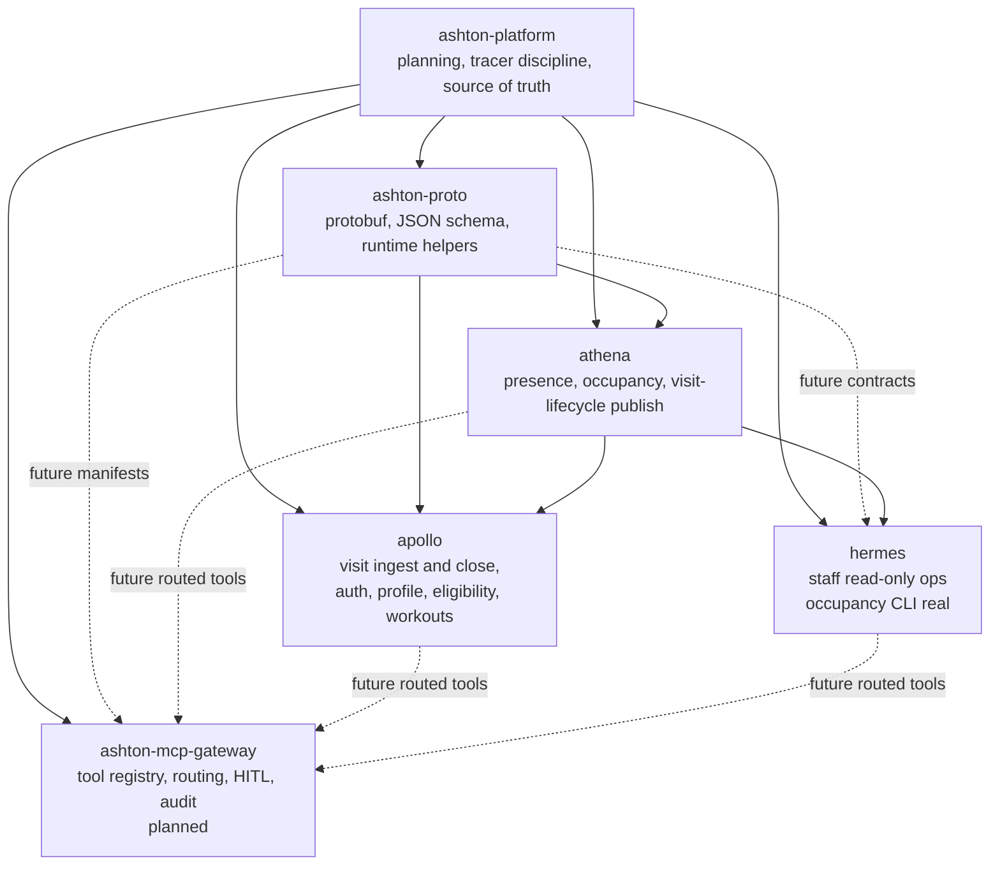
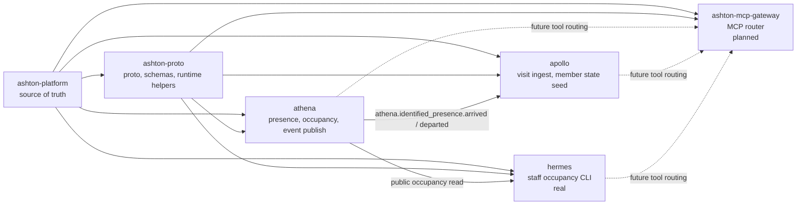

# ashton-platform

Canonical source-of-truth repo for the ASHTON application stack.

> ASHTON is a contract-first, Go-first platform split across five repos with one
> locked ownership model: `ATHENA` owns physical truth, `APOLLO` owns member
> intent, `HERMES` stays staff-only, and `ashton-mcp-gateway` is a later control
> layer built only after the service surfaces are worth routing.

This repo is intentionally not a deployable app. Its job is to keep the system
readable as one coherent platform instead of five drifting repos.

## Current Platform State

| Repo | Role | Current State | Why It Matters |
| --- | --- | --- | --- |
| `ashton-proto` | Shared contracts, schemas, runtime helpers | Real and active | Keeps producers and consumers from hand-rolling wire contracts |
| `athena` | Physical truth for presence and occupancy | Real and executable | First Go service, first operational data surface, and active visit-lifecycle publisher |
| `apollo` | Member-facing application and intent state | Real and executable, but intentionally narrow | First member auth, profile-state, visit-history, visit-closing, derived-eligibility, explicit workout-runtime, and deterministic recommendation slice |
| `hermes` | Staff-facing operations assistant | Real and executable, but intentionally narrow | First read-only staff occupancy slice over ATHENA public truth |
| `ashton-mcp-gateway` | Shared tool routing, approval, and audit layer | Docs-first | Planned control surface after the service repos are stable |

## Architecture

The standalone Mermaid source for the platform system view lives at
[`planning/diagrams/platform-system.mmd`](planning/diagrams/platform-system.mmd).

## Current Real Flow

The current cross-repo flow is narrower than the long-term architecture on
purpose. The standalone Mermaid source lives at
[`planning/diagrams/platform-current-real-flow.mmd`](planning/diagrams/platform-current-real-flow.mmd).

## Platform Tech Stack

| Layer | Technology | Status | Notes |
| --- | --- | --- | --- |
| Shared contracts | Protobuf + Buf | Instituted | The current package layout and generation path are active in `ashton-proto` |
| Shared event validation | JSON Schema + Go runtime helpers | Instituted | `athena` and `apollo` now share one active event helper instead of private structs |
| Physical truth service | Go + chi + Cobra + Prometheus client + NATS | Instituted | `athena` is the first executable service |
| Member ingest and persistence | Go + chi + Cobra + pgx + sqlc + NATS | Instituted | `apollo` currently focuses on auth, profile state, visit ingest, derived eligibility, and explicit workout runtime |
| Staff assistant | Go CLI + upstream HTTP client | Instituted | `hermes` now proves one read-only occupancy question over ATHENA's public API |
| Tool control plane | Go-first MCP router, Postgres audit, HITL approval | Planned | `ashton-mcp-gateway` starts only after service surfaces are stable |
| Redis utility layer | Redis | Deferred | Useful later for caches, rate limiting, and ephemeral hot state |
| APOLLO frontend | SvelteKit PWA | Deferred | Valuable later, but not part of the current executable slice |
| Gateway performance rewrite | Rust | Deferred | The rewrite is earned only after a measured Go bottleneck exists |

## Repo Map

| Repo | Owns | Depends On | Current Truth | Docs |
| --- | --- | --- | --- | --- |
| `ashton-proto` | Shared proto packages, event schemas, runtime helper rules | - | Shared contract baseline is real and active | [README](../ashton-proto/README.md) |
| `athena` | Presence, occupancy, ingress source handling, identified visit-lifecycle publication | `ashton-proto` | Mock-backed read path and lifecycle publish path are real | [README](../athena/README.md) |
| `apollo` | Member auth, profile state, visit ingest and close, derived eligibility, workout runtime, and deterministic recommendation reads | `ashton-proto`, `athena` | Auth, profile state, visit lifecycle, derived eligibility, workout runtime, and deterministic recommendation reads are real | [README](../apollo/README.md) |
| `hermes` | Staff read-only operations over upstream service truth | `athena` | First occupancy CLI slice is real; write actions, agent orchestration, and deployment stay deferred | [README](../hermes/README.md) |
| `ashton-mcp-gateway` | Tool discovery, routing, approval, audit | All service repos | Planned only | [README](../ashton-mcp-gateway/README.md) |

## Current State Block

### Already real in the repos

- `ashton-proto` ships Buf-clean packages, event schemas, generated Go code,
  and shared runtime helpers for
  `athena.identified_presence.arrived` and
  `athena.identified_presence.departed`
- `athena` has a canonical occupancy read path shared by CLI, HTTP, and
  Prometheus
- `athena` can publish identified arrival and departure events through the
  shared `ashton-proto` helpers to NATS
- `apollo` can consume those same events, validate them strictly, and open or
  close visits deterministically in Postgres
- `apollo` can verify member ownership, issue signed sessions, persist profile
  state, and derive open-lobby eligibility from explicit member intent
- `apollo` now serves authenticated workout create, update, finish, detail,
  and history reads without letting visits imply exercise activity
- `apollo` now serves one authenticated deterministic workout recommendation
  read derived from explicit workout history only
- `hermes` now serves one executable read-only staff flow:
  `hermes ask occupancy --facility <id>` reads ATHENA's public occupancy count
  and labels the result as ATHENA-backed truth
- `apollo` keeps visit history separate from workout history and from
  recommendation logic and from matchmaking intent
- repo-local roadmaps, runbooks, ADRs, and growing-pains logs exist across the
  stack

### Real and wired across repos

- `athena` and `apollo` now share one runtime event contract instead of private
  JSON structs
- `hermes` now consumes ATHENA's public occupancy endpoint directly instead of
  inventing a private read model or staff-side truth store
- Tracer 2 proved the first end-to-end flow from physical presence to member
  visit history
- anonymous, malformed, duplicate, no-open, out-of-order, and unknown-tag
  visit-lifecycle events now resolve deterministically instead of being left
  ambiguous

### Planned next

- richer `hermes` staff questions only after a later tracer proves a real need
  beyond occupancy
- `ashton-mcp-gateway` first routed read-only tool call after service surfaces
  are stable
- broader `ashton-proto` contract expansion only when a real cross-repo tracer
  requires it

### Deferred on purpose

- Redis-backed hot state and rate limiting
- ATHENA prediction rollout before the read path and adapters widen
- APOLLO recommendation persistence, generated planning, LangGraph, Mem0, and
  matchmaking runtime
- APOLLO SvelteKit PWA and offline sync work
- gateway Rust rewrite before a measured Go bottleneck exists

## Tracer Milestones

| Tracer | Scope | Status | Outcome |
| --- | --- | --- | --- |
| `Tracer 0` | bootstrap and source-of-truth alignment | Complete | repo layering, first contracts, first executable ATHENA slice |
| `Tracer 1` | presence contract to ATHENA read path | Complete | shared contract baseline plus stable mock-backed read surfaces |
| `Tracer 2` | ATHENA event to APOLLO visit record | Complete | first cross-repo event-driven member-history slice |
| `Tracer 3` | APOLLO member auth to profile state | Complete | make member auth and profile state real without widening into matchmaking |
| `Tracer 4` | explicit lobby eligibility | Complete | make explicit member state drive derived lobby eligibility without letting tap-in imply intent |
| `Tracer 5` | visit closing / departure flow | Complete | close the correct open visit from physical departure truth without creating workouts or social intent |
| `Tracer 6` | APOLLO workout runtime | Complete | make explicit member-owned workout history real without letting visits imply exercise activity |
| `Tracer 7` | APOLLO deterministic recommendation runtime | Complete | derive one member-scoped coaching recommendation from explicit workout history without inferring social or physical intent |
| `Tracer 8` | HERMES read-only staff occupancy path | Complete | answer one bounded staff occupancy question from ATHENA public truth without write authority |

## Milestone 1 Hardening Truth

Milestone 1 closes on the narrow, honest deployment boundary:

- live cluster proof covers the ATHENA read-path slice only
- the live ATHENA deployment is verified as the mock-backed read service for
  health, occupancy count, and Prometheus metrics
- the live `ATHENA -> NATS -> APOLLO` cluster boundary is explicitly deferred
  and is not part of the Milestone 1 deployment claim

That means the current platform truth is:

- cross-repo event behavior is proven locally with real NATS and Postgres
- APOLLO runtime behavior is proven locally with real auth, profile, and
  eligibility smoke checks
- deployed cluster truth for Milestone 1 is the ATHENA read path, not the full
  event-consumer chain

## Milestone 1.5 Deployment Deepening Truth

Milestone 1.5 deepens deployment truth without rewriting Milestone 1's closure:

- live cluster proof now includes a bounded `ATHENA -> NATS -> APOLLO` arrival
  path
- the ATHENA deployment publishes identified arrivals to live in-cluster NATS
- the APOLLO deployment boots its schema in-cluster, consumes the live subject,
  and persists the visit in Postgres
- one live identified arrival `mock-in-001` created the expected APOLLO visit
- replay of that same live identified arrival resolved as `duplicate` and did
  not create a second visit

This claim is still intentionally narrow:

- it proves the bounded visit-ingest arrival path, not a broad APOLLO product
  rollout
- live departure close behavior remains locally proven, not cluster-proven

## Tracer 6 Runtime Truth

Tracer 6 stays intentionally narrower than Milestone 1.5:

- verified local truth now includes APOLLO workout create, update, finish,
  detail, and history reads behind authenticated member ownership
- those workout surfaces were proven against disposable Postgres with a real
  auth/session smoke path
- workout history ordering is now explicit: newest workout created first using
  DB-owned `started_at DESC, id DESC`
- workout runtime remains separate from visits, eligibility, profile intent,
  and claimed tags
- deployed truth is unchanged from Milestone 1.5 and does not yet claim live
  in-cluster workout runtime surfaces

## Tracer 7 Runtime Truth

Tracer 7 stays intentionally narrower than a broad coaching or planning system:

- verified local truth now includes authenticated
  `GET /api/v1/recommendations/workout`
- recommendation precedence is explicit and deterministic:
  `resume_in_progress_workout`, `start_first_workout`, `recovery_day` for
  workouts finished within `24h`, then `repeat_last_finished_workout`
- recommendation reads are derived from explicit APOLLO-owned workout history,
  not from visits, arrivals, departures, or lobby/profile state
- recommendation reads are side-effect free: they do not create, update, or
  finish workouts and they do not mutate visits, preferences, claimed tags, or
  eligibility state
- deployed truth is unchanged from Milestone 1.5 and does not yet claim live
  in-cluster recommendation surfaces

## Tracer 8 Runtime Truth

Tracer 8 stays intentionally narrower than a broad assistant or workflow layer:

- verified local truth now includes
  `hermes ask occupancy --facility <id>`
- the HERMES runtime answers one bounded staff question only: current
  occupancy at a facility
- HERMES reads ATHENA's public
  `GET /api/v1/presence/count?facility=<id>` surface and returns structured
  source-backed output with `facility_id`, `current_count`, `observed_at`, and
  `source_service`
- the slice is strictly read-only: HERMES does not mutate ATHENA, APOLLO, or
  any staff-owned state and does not invent a private truth store
- Tracer 8 hardening intentionally included missing-input, invalid-config,
  malformed-upstream, and unavailable-upstream checks; those expected failures
  are part of the proof that the slice fails clearly instead of fabricating
  answers
- HERMES success-path observability is still thinner than the APOLLO runtime:
  inspection currently relies more on CLI output and runbook commands than on
  dedicated HERMES request/result logs
- deployed truth is unchanged from Milestone 1.5 and does not yet claim live
  in-cluster HERMES runtime surfaces

## Source Of Truth Split

| Need | Use | Why |
| --- | --- | --- |
| Current implementation truth | repo-local `README.md`, `docs/roadmap.md`, ADRs, migrations, schemas, and [`planning/sprints/TRACER-MATRIX.md`](planning/sprints/TRACER-MATRIX.md) | These files track what is actually real now |
| Cross-repo arbitration | [`planning/IMPLEMENTATION-BOARD.md`](planning/IMPLEMENTATION-BOARD.md) and [`planning/runbooks/control-plane.md`](planning/runbooks/control-plane.md) | These files lock ownership, terminology, and tracer discipline |
| Future-state ideas and background rationale | [`planning/architecture/portfolio-architecture.md`](planning/architecture/portfolio-architecture.md) and [`planning/architecture/ashton-addendum-v2.md`](planning/architecture/ashton-addendum-v2.md) | These are background references, not runtime status documents |

The architecture essays still matter, but they are future-leaning. They should
explain where the platform is heading and why earlier choices were made, not
pretend that planned services already exist.

## Project Structure

| Path | Purpose |
| --- | --- |
| `planning/architecture/` | background architecture essays and technology rationale |
| `planning/diagrams/` | standalone Mermaid sources for platform-level diagrams |
| `planning/repo-briefs/` | canonical repo briefs and ownership model |
| `planning/runbooks/` | control-plane and tracer-closure discipline |
| `planning/sprints/` | build order and tracer sequencing |

## Docs Map

- [Implementation board](planning/IMPLEMENTATION-BOARD.md)
- [Tracer matrix](planning/sprints/TRACER-MATRIX.md)
- [Build order](planning/sprints/BUILD-ORDER.md)
- [Control-plane runbook](planning/runbooks/control-plane.md)
- [Platform system diagram](planning/diagrams/platform-system.mmd)
- [Current real flow diagram](planning/diagrams/platform-current-real-flow.mmd)
- [ATHENA brief](planning/repo-briefs/athena.md)
- [APOLLO brief](planning/repo-briefs/apollo.md)
- [HERMES brief](planning/repo-briefs/hermes.md)
- [ASHTON-PROTO brief](planning/repo-briefs/ashton-proto.md)
- [Gateway brief](planning/repo-briefs/ashton-mcp-gateway.md)
- [Portfolio architecture](planning/architecture/portfolio-architecture.md) - background reference
- [Architecture addendum](planning/architecture/ashton-addendum-v2.md) - background reference

## Infra Boundary

Infrastructure remains outside this repo on purpose:

- `../Computers/Prometheus`
- `../Computers/Talos`

Those repos are the platform substrate. ASHTON documents its own internal
system logic here and treats the homelab layer as an external dependency rather
than mixing infrastructure status into the application architecture.

## Why This Platform Matters

Read together, these repos tell a stronger story than any one service alone:
contract discipline, Go services, event-driven integration, operational
boundaries, documentation maturity, and a deliberate separation between what is
real now and what is only planned.
