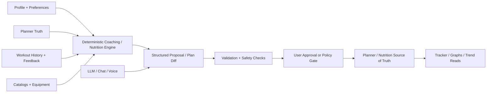

# Coaching, Nutrition, and AI Architecture

This document captures the intended architecture for future coaching,
nutrition, and AI-assisted product work in ASHTON.

It is a planning document.
It is not current runtime truth.
It does not change the current release ladder by itself.

Current control-plane truth remains:

- `Tracer 24`: deterministic coaching substrate
- `Tracer 25`: conservative nutrition substrate
- `Tracer 26`: explanation, summarization, and thin agent-facing helper
  surfaces
- `Tracer 27`: member presence / tap-link / streak substrate
- `Tracer 28`: role/authz and staff runtime boundary substrate
- `Milestone 2.0`: Phase 2 backend/base plateau closeout

This document records the reasoning behind that split and how the AI layer
should sit on top of it.

## Dependency Boundary

This document is directly about `Tracer 24` through `Tracer 26`, but those
lines are not the whole Phase 2 safety story.

Two later Phase 2 lines still matter for trustworthy AI and agent use:

- `Tracer 27` keeps presence and streak truth explicit instead of letting
  coaching or nutrition infer product state from taps silently
- `Tracer 28` adds the role/authz, actor-attribution, trusted-surface, and
  approval substrate required before broader agent-originated writes can be
  honest

## Purpose

The goal is to leave room for strong AI-assisted coaching and nutrition without
making the LLM the first owner of durable truth.

The platform should become:

- AI-assisted
- not chatbot-first
- conservative by default
- explicit about limitations
- grounded in structured state models

## Core Rule

Multiply:

- durable state models
- ownership boundaries
- negative-proof coverage
- honest docs

Do not multiply:

- speculative endpoints
- premature public contracts
- convenience surfaces we are not sure we want long term

## What Deterministic Means Here

`Deterministic` does not mean crude or inflexible.

It means:

- the core recommendation path is rule-driven
- the same inputs produce the same output
- the decision path is inspectable
- the system can explain why it proposed a change
- the system can be regression-tested cleanly
- the LLM is not silently changing durable state on its own

In practice, deterministic coaching or nutrition should be implemented as:

- typed inputs
- conservative policy rules
- bounded scoring or selection logic
- explicit safety clamps
- structured recommendation outputs
- explicit approval or apply steps before planner truth changes

## Why Deterministic First Does Not Gimp The Product

Done well, a deterministic substrate does not block personalization.
It creates safe rails for personalization.

The platform can still personalize using explicit structured inputs such as:

- age band
- training age
- stated goal
- available days per week
- session length
- available equipment
- recent workout history
- effort feedback
- recovery feedback
- dietary restrictions
- budget
- cooking ability
- cuisine preferences

Those inputs should drive conservative first-pass recommendations.
The LLM can later improve wording, substitutions, and interaction quality
without becoming the unbounded policy engine.

## What Should Be Hard Rules

The deterministic layer should own:

- cold-start logic
- conservative starting loads
- progression limits
- deload or regression triggers
- substitution rules
- equipment compatibility
- session-shape constraints
- calorie and macro range floors and ceilings
- restriction filtering
- warning and escalation rules

Examples:

- do not increase planned load beyond a bounded weekly threshold
- do not suggest equipment the member does not have access to
- do not produce nutrition guidance that conflicts with declared restrictions
- do not respond to pain or injury reports with confident medical advice

## What Should Not Be Hard Rules Alone

The hard-rule layer should not carry the whole interaction burden.

The AI/helper layer can own:

- explanation
- simplification
- rewriting
- tone adaptation
- preference-aware variants
- substitution suggestions inside deterministic bounds
- FAQ
- optional chat or voice interpretation

This lets the product feel intelligent without making the core logic opaque.

## Cohorts, Restriction Modes, and Personalization

The platform should not rely on the LLM to invent safety cohorts.
Those belong in explicit structured policy inputs.

Reasonable policy dimensions include:

- age band
- training age or experience tier
- goal family
- recovery sensitivity
- equipment access tier
- dietary restriction set
- cooking capability tier
- budget tier

Potentially sensitive dimensions such as sex-related considerations should only
be used when:

- the member explicitly provides the input
- the product can justify why it affects guidance
- the policy is conservative and reviewable
- the product does not drift into diagnosis or clinical claims

This should not become an identity taxonomy project.
Only keep dimensions that materially affect conservative planning.

## Pain, Injury, and Medical Boundaries

The product should not behave like a cardiologist, physiotherapist,
chiropractor, or other clinician.

The safe product posture is:

- wellness guidance
- conservative training and meal suggestions
- explicit limitations
- escalation language when pain, injury, or medical concerns appear

If a member reports pain, dizziness, unusual symptoms, or other clinical
signals, the system should:

- avoid diagnosis
- avoid pretending it knows the cause
- reduce or pause guidance where appropriate
- advise professional medical review where warranted

That boundary should be enforced in both deterministic rules and AI behavior.

## Durable Models Needed Before Heavy AI UX

### Coaching-Side Models

- `coaching_profile`
- `training_goal`
- `effort_feedback`
- `recovery_feedback`
- `progress_metric`
- `personal_record`
- `coaching_recommendation`
- `coaching_explanation`
- `plan_change_proposal`
- `proposal_application`

### Nutrition-Side Models

- `nutrition_profile`
- `dietary_restriction`
- `meal_preference`
- `budget_preference`
- `cooking_capability`
- `meal_log`
- `nutrition_recommendation`
- `nutrition_explanation`

### Shared Interaction Models

- `assistant_request`
- `assistant_suggestion`
- `assistant_suggestion_feedback`
- `assistant_action_proposal`
- `assistant_action_decision`

The shared interaction models are useful later, but the domain models must come
first.

## Source-Of-Truth Boundary

The planner should remain the approved plan truth.
Workouts should remain execution and history truth.
Tracker views should remain derived read models.

The coaching engine should propose changes.
It should not silently mutate planner truth.

The write path should look like this:

The key rule is simple:

- AI may propose
- the domain layer validates
- approved state becomes truth

## LLM Role

The LLM should not own:

- durable planner state
- coaching progression truth
- nutrition target truth
- medical or legal policy
- silent write authority

The LLM can own:

- conversational intake
- voice-note interpretation
- explanation
- suggestion reframing
- bounded alternatives
- structured proposal drafting
- agent-facing helper reads

This is the safe path to future AI depth.

## Chat And Voice Strategy

The product should not launch Phase 2 as a generic coaching chatbot.

The better sequence is:

1. structured recommendation cards
2. explicit helper actions such as:
   - `Why this?`
   - `Make it easier`
   - `Make it cheaper`
   - `Swap for no kitchen access`
   - `Swap because that machine is busy`
3. bounded ask-for-variation flows
4. optional chat or voice doorway only after the recommendation objects and
   plan-diff objects are stable

This keeps chat as an interface, not the product core.

## Agentic CLI Strategy

APOLLO already has a real CLI/runtime boundary.
Future agentic or CLI access should reuse the same domain services as HTTP.

Preferred rule:

- one canonical service layer
- HTTP and CLI both call the same services
- assistant or agent surfaces consume stable read models and submit structured
  proposals
- preview, approval, and application stay inside APOLLO-owned validation logic
- actor attribution and capability checks stay explicit
- AI or agent-originated writes never bypass proposal/apply rails

This keeps agentic access additive instead of creating a second source of
truth.

## Agentic-Native Delta

The safe Phase 2 path to an agent-friendly backend is:

| Line | Agentic gain |
| --- | --- |
| `Tracer 24` | structured coaching recommendation and proposal models |
| `Tracer 25` | structured nutrition recommendation and proposal models |
| `Tracer 26` | explanation, helper reads, and bounded AI proposal surfaces |
| `Tracer 28` | permission, actor, approval, audit, and concurrency substrate for broader safe mutation |
| `Milestone 2.0` | proof that agents can inspect and propose modularly without hidden write authority |

Broad autonomous mutation should still remain out until after `Tracer 28` and
`Milestone 2.0`.

## Recommended Tracer Shape

### `Tracer 24`

`Deterministic coaching substrate`

Make real:

- richer coaching profile inputs
- effort and recovery feedback
- conservative starting-load logic
- structured progression suggestions
- explicit explanation fields

Do not include:

- meal runtime
- macro engine
- chatbot UI
- opaque model-driven core decisions

### `Tracer 25`

`Conservative nutrition substrate`

Make real:

- nutrition profile
- dietary restrictions
- meal preferences
- budget and cooking capability
- meal log
- conservative macro and calorie ranges

Do not include:

- diagnosis
- unrestricted supplement advice
- freeform chatbot as the primary runtime

### `Tracer 26`

`Explanation and bounded AI helper layer`

Make real:

- explanation surfaces
- suggestion rewriting
- ask-why flows
- ask-for-variation flows
- optional chat-ready doorway if the deterministic cores are already stable

### `Tracer 27`

`Separate presence and streak truth from coaching and nutrition`

Make real:

- explicit visit/tap-link product state
- streak state and streak events
- a clear boundary so coaching and nutrition do not silently infer product
  truth from presence alone

### `Tracer 28`

`Role/authz and safe mutation boundary`

Make real:

- explicit actor and capability boundary
- trusted-surface primitives
- approval and audit substrate for later AI- or agent-originated actions

## UI Consequences

The future UI can absolutely support:

- `Tracker`
- `Planner`
- `Coaching`
- `Meals`
- `Competition`
- `Settings`

But the UI should not imply that all of those surfaces are equally runtime-real
before the backend proves them.

Safe early UI:

- planner/tracker built over real truth
- coaching as structured cards before chat
- meals as honest placeholder until nutrition models are real
- tracker graphs derived from workout and planner truth

Unsafe early UI:

- fake AI coach that writes directly into plans
- fake pain or injury advice
- fake nutrition intelligence without runtime models
- chat-first UX with no bounded action model underneath it

## Branding Note

A future assistant identity such as `Coach Colt` is compatible with this
architecture.

If used, that identity should be treated as:

- presentation and brand layer
- explanation and helper interface
- not the owner of recommendation truth

The personified assistant can feel friendly.
The system behind it still needs conservative deterministic rails.

## Decision Summary

1. Keep deterministic domain logic as the first owner of coaching and nutrition
   truth.
2. Let AI improve intake, explanation, and proposal quality later.
3. Keep planner truth separate from coaching proposals.
4. Treat chat and voice as future interfaces over structured models.
5. Do not frame the product as clinical or diagnostic.
6. Keep the coaching, nutrition, and AI-helper lines split by domain rather
   than collapsing them back into one broad tracer.
7. Keep presence/streak truth and role/authz truth as separate Phase 2 lines so
   later AI assistance does not smuggle in hidden authority or hidden state.
