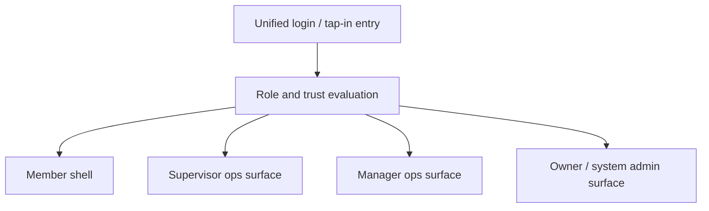

# ASHTON UI Product Vision

This document captures the current UI and product-direction vision for ASHTON.

It is not the runtime source of truth.
It is not a release ledger.
It is the working product and UX vision for the future member and operations
surfaces so the direction stays coherent before the frontend runtime is built.

## Intent

| Area | Position |
| --- | --- |
| Product shape | one product with distinct member and operations shells |
| Delivery posture | envision first, then prototype, then harden |
| Frontend priority | member shell should feel native on phones; ops shell should feel sharp on laptops |
| Architecture posture | keep UI vision wide while implementation stays narrow and staged |
| Current scope | product flows, role boundaries, surface design, launch sequencing |
| Not covered here | final backend contracts, detailed data models, release commitments |

## Core Product Thesis

ASHTON should become one coherent system with two intentionally different
experiences:

- a phone-first member experience that feels calm, modern, fast, and rewarding
- a denser operations experience for staff, managers, and owners

The product should not pretend that one layout fits all actors.

Members need speed, clarity, and momentum.
Operations users need visibility, control, and trustworthy detail density.

## Product Split

| Shell | Primary audience | Primary device bias | Purpose |
| --- | --- | --- | --- |
| Member shell | members / students | iPhone and Android phones first | workouts, meals, presence, competition, personalization |
| Ops shell | supervisors, managers, owners | laptop first, phone-capable for triage | facility operations, queues, schedules, oversight, analytics |

Both shells should still share:

- one visual language
- one authentication entrypoint
- one design token system
- one role-aware routing model

## Actor Model

| Actor | What they need most |
| --- | --- |
| Guest | hours, contact details, facility basics, booking entrypoint |
| Member | tap-in, streaks, workouts, meals, standings, queues, profile identity |
| Supervisor | live operational controls with constrained authority |
| Manager | tournaments, schedules, event setup, broader facility control |
| Owner / system admin | private metrics, analytics, exports, AI and policy oversight |
| Business booker | account-based court or facility booking requests |

## Role Boundaries

| Role | Should have | Should not have |
| --- | --- | --- |
| Member | self-service product features, self history, self planning, app personalization | broad facility controls or private data about other members |
| Supervisor | member features plus lightweight live edits and operational interventions | private body metrics, private plan data, deep tap-history analytics |
| Manager | supervisor powers plus event and schedule management | owner-only governance and full sensitive exports |
| Owner / system admin | all surfaces plus sensitive metrics, export, governance, role management | unnecessary day-to-day friction for basic operations |

## Navigation Model

The member shell should use a bottom navigation bar with a hard cap of five
tabs.

Recommended base navigation:

| Tab | Why it exists |
| --- | --- |
| Meals | meal logging and planning need dedicated recurring access |
| Workouts | workout logging and planning are core daily actions |
| Home | central dashboard and default landing surface |
| Tournaments | queue, standings, rivalry, and competition actions belong together |
| Settings | support, facility details, app controls, and lower-frequency account tools |

Profile should not be a bottom-tab destination.
It should live behind the top-right avatar entry and be reachable from Home and
Settings.

That keeps the navigation balanced while preserving profile importance.

## Member Shell Vision

### Home

Home should be the living center of the member experience.

It should answer:

- am I checked in right now
- what should I do next
- what changed since my last visit
- what part of my progress is worth noticing today

Likely Home modules:

- streak and tap-in state
- today card for workout or recovery
- meal summary and plan reminder
- next queue or competition status
- facility alerts, hours, or closures
- achievement or progression spotlight

### Meals

Meals should combine tracking and planning inside one tab instead of splitting
them into separate major destinations.

Core ideas:

- fast meal logging
- macro and calorie guidance
- day and week summaries
- future conservative recommendation layer based on history and profile inputs

### Workouts

Workouts should combine tracker and planner in one tab.

The UI should favor:

- quick start from a template or recent workout
- strong in-session logging for sets, reps, load, and notes
- clean workout history and progression views
- simple structured editing instead of cluttered forms

Modern interaction candidates:

- expandable exercise cards
- bottom-sheet editors for adding or editing an exercise
- recent-template shortcuts
- swipe or long-press utilities only where they truly save time

### Tournaments

Tournaments should gather the competitive identity of the product into one
surface.

Likely sub-surfaces:

- casual queue
- leaderboards and standings
- win streaks
- rivalries and recurring matchups
- best games and recent results
- team signup and tournament enrollment

This area should feel energizing without becoming visually noisy.

### Settings

Settings should hold lower-frequency but still important controls such as:

- support and contact
- facility switcher
- facility hours
- FAQ and assistant access
- theme preferences
- app-level behavior preferences

## Identity, Presence, And Login

There should be one login screen with a polished branded splash background and
a smooth entry animation.

That entrypoint should support two core member paths:

| Path | Purpose |
| --- | --- |
| Tap in | confirm real facility presence, preserve streaks, and connect physical attendance to the account |
| Sign in | enter the app for workouts, meals, queues, settings, and other digital features |

The product should also support a later electronic tap flow where a signed-in
member can confirm real presence by scanning a facility QR code.

The authentication entrypoint can stay visually unified while role-aware routing
determines the destination after login.

## Ops Shell Vision

The operations side should not copy the member UI.

It should feel like an intentional control surface with more density and more
simultaneous context.

Recommended desktop layout:

- left navigation rail
- main board or workspace
- optional right-side inspector or detail panel

Recommended phone posture:

- triage and approval access
- limited editing for urgent actions
- not full parity with the best desktop workflow

## Ops Role Surfaces

| Role | Core screens |
| --- | --- |
| Supervisor | live board, match adjustments, queue oversight, court state, simple notes |
| Manager | event setup, schedules, tournament controls, queue rules, broader facility management |
| Owner / system admin | analytics, sensitive member data, exports, AI governance, role management |

## Design Direction For 2026+

The product should look current and fluid without falling into generic SaaS
design.

Member shell direction:

- calm and kinetic
- clean but slightly playful
- welcoming without feeling childish
- strong visual reward loops for streaks, progress, and identity

Ops shell direction:

- crisp, instrument-like, denser, more operational
- high information density with clear grouping
- faster scanning and less decorative noise

Universal UI rules:

- avoid generic white-card dashboards
- use a real token system for color, type, motion, radius, spacing, and banners
- prefer meaningful transitions over constant animation
- optimize perceived speed with skeletons, progressive loading, and live states

## Launch Reality

This should launch as a web product first.

The initial target should be a phone-first progressive web app for members and a
responsive web interface for operations users.

That path is realistic because it:

- avoids app-store dependency early
- reduces cost and release friction
- keeps the future path open for native packaging later

## Achievable Early Scope

Reasonable early launch scope:

- member sign-in
- tap-in and streak tracking
- workouts tracking
- meal tracking
- queue and standings reads
- role-aware operations views
- support, hours, contact, and FAQ assistant

Better treated as later-phase features:

- private direct messaging
- broad social layers
- heavy AI plan generation before enough trusted history exists
- deep predictive modeling before the event and recommendation substrate is stable

## Technical Direction

Recommended starting stack:

| Area | Recommendation | Why |
| --- | --- | --- |
| Frontend framework | SvelteKit + TypeScript | fast iteration, SSR when useful, strong PWA path |
| Styling | plain CSS with design tokens | easier to reason about than Tailwind for this project style |
| Mobile strategy | PWA first | lowest-cost launch path with native-like behavior where possible |
| Native bridge later | Capacitor or equivalent wrapper | reuse the web UI if store distribution becomes worthwhile |
| Backend | existing Go service boundaries | preserves the platform architecture already in motion |
| Core data store | Postgres | practical default for operational and member data |
| Visualization | Apache ECharts | strong dashboard and telemetry potential |

## Repository Direction

The UI vision document should live in `ashton-platform` because it is
cross-cutting product planning, not repo-local runtime behavior.

When real frontend implementation begins, the best default is a dedicated
frontend repo rather than burying the new runtime inside `apollo` or `hermes`.

That future repo would likely own:

- the shared design system
- the member shell
- the ops shell
- PWA packaging and build concerns
- frontend routing and composition across backend services

## Flow Snapshot

## Immediate Envisioning Priorities

The highest-value flow design targets are:

1. new member onboarding
2. tap-in and streak continuation
3. workout start, logging, and finish
4. meal logging and planning
5. queue entry and competition participation
6. supervisor live intervention
7. manager event and schedule control
8. owner analytics and policy review

## Status

This document is the current UI and product-direction baseline.
It should evolve as the backend and runtime surfaces become more real.
